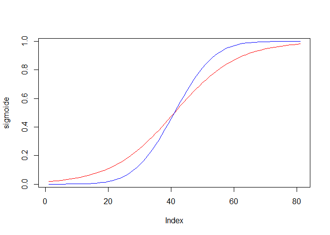

Machine Learning vs Análisis Estadístico
----------------------------------------

Ejemplo pricing de una empresa: si quiero optimizar precios sera machine
learning (no puedo interpretar coeficientes del modelo como en Analisis
Estadístico). En machine learning hago pruebas de estabilidad (cambio en
training) Si quieres algo que prediga directamente utilizas Machine
Learning.

Si quieres entender porque ocurren las cosas y como se interpretan las
cosas....Análisis estadístico. (como se fija y porque, por ejemplo, para
explicar a un cliente)

Modelos machine learning y Analisis Estadísticos no son los mismo.

Tenemos:

-   Modelo, saco coeficientes según que minimizo, no hay un modelo hay
    muchos modelos, hay diferentes coeficientes según si minimizo error,
    max beneficios, minimiza error cuadrado.... a partir de esa
    formula predecimos.
-   Estimación
-   Explotación

Analisis Estadístico

Regresión lineal: me interesan las variables que pueda controlar, sobre
las que pueda hacer algun cambio para mejorar el resultado.

Hipótesis: creo que si bajo el precio subirán las ventas un 20%, hago un
experimento y saco mi conclusion al 95%

Las variables tienen que ser independientes, la varianza tiene que ser
igual para todas las observaciones, los errores tienen distribucion
normal.

Si no se cumple lo anterior la interpretación nos dará datos pero no
será completamente correcto. Pero a veces es mejor tener esta
información a nada.

Estimación: MCO minimos cuadrados, el valor que tenía menos el valor que
tiene por las variables predictivas. El error es la realidad menos la
estimación. Lo elevo al cuadrado para que los negativos y positivos no
se compensen. Busco el valor de "a"(coeficientes) que haga que eso sea
más pequeño.(Los coeficientes solo son insesgados en MCO, el valor aprox
el limite al valor real) Si utilizo valores absolutos me dará otros
coeficientes.

RSA casos que no se pueden resolver. Buscar un password, hay tantas
combinaciones que la tecnologia no lo permite.

gradient accent:busca optimos locales, iterando, tenga la forma que
tenga la funcion, siempre te da algo.

Descomposición de la varianza:

Quiero calcular las variaciones de y (variable dependiente), tenemos la
varianza de y, tengo la varianza del error. varianza y = varianza modelo
+ varianza error

varianza del modelo/varianza y = % coef denominacion que pocentaje de y
está representado en el modelo

Hay que poner un criterio, entre que porcentaje tiene que estar. Hay
cosas que serán totalmente subjetivos. Si todas las variables que tu
quieres estudiar están en el modelo, para ti estará bien aunque salga
error alto.

Ejemplo Regresion lineal: lm(cantidad~Precio,data=ventas)

Tengo que saber en que unidades estanlas variables, miles.... Tiene que
tener sentido el modelo, puede no ser lineal.

std.error si es igual que a, mal asunto es error es igual que el
coeficiente. (cuando hago el lm)

t value es el coef entre estimate/15.778 o lo que es lo mismo
a/std.error . El p valor es la probabilidad que sea mayor que el valor
absoluto de t value.

Multiple R-squared:0.8233 el modelo ajusta el 0.82%, y está representado
en el modelo este porcentaje (coef.determinacion)

Adjusted R-squered: Te penalizaa por no tener algun parametro. Pero te
da una ganancia. La gente se suele fijar en éste.N registros,K
variables. Si aumento K le cociente es más grande

F-statistic: contraste de todo el modelo. el modelo sirve para algo??
compara modelos, mejora tener el modelo solo de la constante. p-value es
menor de 0.01, aporta algo.

El contraste F te permite comparar un modelo con el siguiente, el
primero tiene solo una variable, añado otra, entonces comparo los dos
para ver si me sirve o no meter esa variable.

Práctica Regresión Lineal
=========================

Iniciamos librerias:

    library(ggplot2)
    library(effects)
    library(plyr)
    library(ROCR)

    ## Loading required package: gplots

    ## 
    ## Attaching package: 'gplots'

    ## The following object is masked from 'package:stats':
    ## 
    ##     lowess

Carga de datos:

    creditos=read.csv("D:/master/data/Regresiones/creditos.csv",stringsAsFactors = FALSE)

Revisión de los datos:

-   income es salario hora
-   product contratados por el cliente
-   educacion años educacion, cuantos mas mas educacion
-   Balance saldo cuenta cliente

<!-- -->

    str(creditos)

    ## 'data.frame':    300 obs. of  10 variables:
    ##  $ Income   : num  14.9 106 104.6 148.9 55.9 ...
    ##  $ Rating   : int  283 483 514 681 357 569 259 512 266 491 ...
    ##  $ Products : int  2 3 4 3 2 4 2 2 5 3 ...
    ##  $ Age      : int  34 82 71 36 68 77 37 87 66 41 ...
    ##  $ Education: int  11 15 11 11 16 10 12 9 13 19 ...
    ##  $ Gender   : chr  " Male" "Female" " Male" "Female" ...
    ##  $ Mortgage : chr  "No" "Yes" "No" "No" ...
    ##  $ Married  : chr  "Yes" "Yes" "No" "No" ...
    ##  $ Ethnicity: chr  "Caucasian" "Asian" "Asian" "Asian" ...
    ##  $ Balance  : int  333 903 580 964 331 1151 203 872 279 1350 ...

    head(creditos)

    ##    Income Rating Products Age Education Gender Mortgage Married Ethnicity
    ## 1  14.891    283        2  34        11   Male       No     Yes Caucasian
    ## 2 106.025    483        3  82        15 Female      Yes     Yes     Asian
    ## 3 104.593    514        4  71        11   Male       No      No     Asian
    ## 4 148.924    681        3  36        11 Female       No      No     Asian
    ## 5  55.882    357        2  68        16   Male       No     Yes Caucasian
    ## 6  80.180    569        4  77        10   Male       No      No Caucasian
    ##   Balance
    ## 1     333
    ## 2     903
    ## 3     580
    ## 4     964
    ## 5     331
    ## 6    1151

    tail(creditos)

    ##     Income Rating Products Age Education Gender Mortgage Married
    ## 295 42.915    205        4  42        13   Male       No     Yes
    ## 296 27.272    149        5  67        10 Female       No     Yes
    ## 297 65.896    370        1  49        17 Female       No     Yes
    ## 298 55.054    321        3  74        17   Male       No     Yes
    ## 299 20.791    204        1  70        18 Female       No      No
    ## 300 24.919    372        3  76        11 Female       No     Yes
    ##            Ethnicity Balance
    ## 295            Asian       0
    ## 296        Caucasian       0
    ## 297        Caucasian     293
    ## 298            Asian     188
    ## 299 African American       0
    ## 300 African American     711

    summary(creditos)

    ##      Income           Rating         Products          Age       
    ##  Min.   : 10.35   Min.   : 93.0   Min.   :1.000   Min.   :24.00  
    ##  1st Qu.: 21.03   1st Qu.:235.0   1st Qu.:2.000   1st Qu.:41.00  
    ##  Median : 33.12   Median :339.0   Median :3.000   Median :55.00  
    ##  Mean   : 44.05   Mean   :348.1   Mean   :3.027   Mean   :54.98  
    ##  3rd Qu.: 55.98   3rd Qu.:433.0   3rd Qu.:4.000   3rd Qu.:69.00  
    ##  Max.   :186.63   Max.   :949.0   Max.   :8.000   Max.   :91.00  
    ##    Education        Gender            Mortgage           Married         
    ##  Min.   : 5.00   Length:300         Length:300         Length:300        
    ##  1st Qu.:11.00   Class :character   Class :character   Class :character  
    ##  Median :14.00   Mode  :character   Mode  :character   Mode  :character  
    ##  Mean   :13.39                                                           
    ##  3rd Qu.:16.00                                                           
    ##  Max.   :20.00                                                           
    ##   Ethnicity            Balance       
    ##  Length:300         Min.   :   0.00  
    ##  Class :character   1st Qu.:  15.75  
    ##  Mode  :character   Median : 433.50  
    ##                     Mean   : 502.69  
    ##                     3rd Qu.: 857.75  
    ##                     Max.   :1809.00

Tratamiento de variables:

La regresion lineal y logistica trabaja con Factores El coef sobre la
variable Educacion no es continua, aplico el mismo coeficiente a cada
año que tengo de mas de educacion b1\*x1, pero no es lo mismo 10 años
que 11 que he terminado.(eso sería tratarlo como una variable continua)

    creditos$Gender=as.factor(creditos$Gender)
    creditos$Mortgage=as.factor(creditos$Mortgage)
    creditos$Married=as.factor(creditos$Married)
    creditos$Ethnicity=as.factor(creditos$Ethnicity)

    summary(creditos)

    ##      Income           Rating         Products          Age       
    ##  Min.   : 10.35   Min.   : 93.0   Min.   :1.000   Min.   :24.00  
    ##  1st Qu.: 21.03   1st Qu.:235.0   1st Qu.:2.000   1st Qu.:41.00  
    ##  Median : 33.12   Median :339.0   Median :3.000   Median :55.00  
    ##  Mean   : 44.05   Mean   :348.1   Mean   :3.027   Mean   :54.98  
    ##  3rd Qu.: 55.98   3rd Qu.:433.0   3rd Qu.:4.000   3rd Qu.:69.00  
    ##  Max.   :186.63   Max.   :949.0   Max.   :8.000   Max.   :91.00  
    ##    Education        Gender    Mortgage  Married              Ethnicity  
    ##  Min.   : 5.00    Male :132   No :268   No :117   African American: 78  
    ##  1st Qu.:11.00   Female:168   Yes: 32   Yes:183   Asian           : 81  
    ##  Median :14.00                                    Caucasian       :141  
    ##  Mean   :13.39                                                          
    ##  3rd Qu.:16.00                                                          
    ##  Max.   :20.00                                                          
    ##     Balance       
    ##  Min.   :   0.00  
    ##  1st Qu.:  15.75  
    ##  Median : 433.50  
    ##  Mean   : 502.69  
    ##  3rd Qu.: 857.75  
    ##  Max.   :1809.00

*Test diferencia de medias Regresion lineal:*

    head(creditos)

    ##    Income Rating Products Age Education Gender Mortgage Married Ethnicity
    ## 1  14.891    283        2  34        11   Male       No     Yes Caucasian
    ## 2 106.025    483        3  82        15 Female      Yes     Yes     Asian
    ## 3 104.593    514        4  71        11   Male       No      No     Asian
    ## 4 148.924    681        3  36        11 Female       No      No     Asian
    ## 5  55.882    357        2  68        16   Male       No     Yes Caucasian
    ## 6  80.180    569        4  77        10   Male       No      No Caucasian
    ##   Balance
    ## 1     333
    ## 2     903
    ## 3     580
    ## 4     964
    ## 5     331
    ## 6    1151

    t.test(Income ~ Gender, data = creditos)#p-value=0.7345 t=0.3395,mean female=43,46, male=44,8

    ## 
    ##  Welch Two Sample t-test
    ## 
    ## data:  Income by Gender
    ## t = 0.3395, df = 284.51, p-value = 0.7345
    ## alternative hypothesis: true difference in means is not equal to 0
    ## 95 percent confidence interval:
    ##  -6.405656  9.075923
    ## sample estimates:
    ##  mean in group  Male mean in group Female 
    ##             44.80207             43.46693

    #conf.level=0.95 si quisieramos indicar otro nivel.

P-value calculo, pt(x,df) returns the area under the density to the left
of x.

    p.value = 2*pt(-abs(0.3395), df=284.51)
    p.value

    ## [1] 0.7344836

male$Income calculo t-student:

    male <- creditos[creditos$Gender==" Male",]
    female <- creditos[creditos$Gender=="Female",]
    meanmale <- mean(male$Income)#44.80207
    meanfemale <- mean(female$Income)#43.46693
    n1 <- nrow(male)#132
    n2 <- nrow(female) #168
    var1 <- var(male$Income)
    var2 <- var(female$Income)
    ds1 <- sd(male$Income)# 33.43763
    ds2 <- sd(female$Income)

    hist(creditos$Income)

 Plot
Densidad de Income

    plot(density(creditos$Income))

Densidad del Income por Gender

    library(ggplot2)
    qplot(creditos$Income, colour=factor(creditos$Gender), data=creditos, geom="density",main="Income Density by Gender")

max(female*I**n**c**o**m**e*)*m**a**x*(*m**a**l**e*Income) \#\#Test
Normalidad Anderson The test rejects the hypothesis of normality when
the p-value is less than or equal to 0.05

    library(kSamples)

    ## Loading required package: SuppDists

    ad.test(male$Income,female$Income)

    ## 
    ## 
    ##  Anderson-Darling k-sample test.
    ## 
    ## Number of samples:  2
    ## Sample sizes:  132, 168
    ## Number of ties: 0
    ## 
    ## Mean of  Anderson-Darling  Criterion: 1
    ## Standard deviation of  Anderson-Darling  Criterion: 0.75657
    ## 
    ## T.AD = ( Anderson-Darling  Criterion - mean)/sigma
    ## 
    ## Null Hypothesis: All samples come from a common population.
    ## 
    ##                AD    T.AD  asympt. P-value
    ## version 1: 0.7257 -0.3625           0.5386
    ## version 2: 0.7230 -0.3656           0.5404

    qqnorm(male$Income)

    qqnorm(female$Income)

    hist(male$Income,breaks=100)

    hist(female$Income,breaks=100)

\#\#\#Cálculo T-student 1: Diferentes tamaños muestrales, iguales
varianzas:

    sxx <- sqrt((((n1-1)*var1)+((n2-1)*var2))/(n1+n2-2))
    raiz <- sqrt((1/n1)+(1/n2))
    t <- (meanmale-meanfemale)/(sxx*raiz)
    t

    ## [1] 0.3384819

### Prueba t de Welch:

Diferentes tamaños muestrales, diferentes varianzas:

    sx1x2 <- sqrt((var1/n1)+(var2/n2))
    t <- (meanmale-meanfemale)/(sx1x2)
    t

    ## [1] 0.3394994

Resultado: **No hay evidencia significativa de que sean diferentes. No
podemos rechazar la igualdad de las medias**

*Modelo Lineal* En este caso, el R² es simplemente el cuadrado del
coeficiente de correlación de Pearson, lo cual es sólo cierto para la
regresión lineal simple

    modeloT=lm(Income ~ Gender, data = creditos)
    summary(modeloT)

    ## 
    ## Call:
    ## lm(formula = Income ~ Gender, data = creditos)
    ## 
    ## Residuals:
    ##    Min     1Q Median     3Q    Max 
    ## -34.45 -22.49 -11.33  11.99 143.17 
    ## 
    ## Coefficients:
    ##              Estimate Std. Error t value Pr(>|t|)    
    ## (Intercept)    44.802      2.952  15.178   <2e-16 ***
    ## GenderFemale   -1.335      3.944  -0.338    0.735    
    ## ---
    ## Signif. codes:  0 '***' 0.001 '**' 0.01 '*' 0.05 '.' 0.1 ' ' 1
    ## 
    ## Residual standard error: 33.91 on 298 degrees of freedom
    ## Multiple R-squared:  0.0003843,  Adjusted R-squared:  -0.00297 
    ## F-statistic: 0.1146 on 1 and 298 DF,  p-value: 0.7352

    plot(modeloT)

Recta de regresión es y= 44.802 - 1.335\*x (x=1 cuando es mujer, 0
cuando es hombre) std-error= 2.952 p-value=0.7352 cuando x=1, y =43,46
Podría coger otro modelo e ir metiendo variables, el modelo perfecto es
el que las variables fueran independientes si no lo son te generan
ruido, cuando sube una baja la otra. Resultado:

**No aporta nada este modelo casi es el valor de la constante.**

Regresión Lineal Individual
---------------------------

Mide correlacion, no mide causa-efecto. Está relacionado, ejemplo, la
edad influye en el impago, con la edad gana más dinero, lo que influye
no es la edad es el ingreso...Si metes la variable ingreso la edad
desaparece. Vamos viendo una a una las variables:

    modeloInd1=lm(Income ~ Rating, data = creditos)# Rating es Puntuaje sobre la capacidad impago 
    #de 0-1000, cuanto mas grande mejor pagador.
    summary(modeloInd1)#el rating explica el 60% de los ingresos o los ingresos explican el 60% del 

    ## 
    ## Call:
    ## lm(formula = Income ~ Rating, data = creditos)
    ## 
    ## Residuals:
    ##    Min     1Q Median     3Q    Max 
    ## -40.05 -15.74  -0.80  14.14  81.48 
    ## 
    ## Coefficients:
    ##               Estimate Std. Error t value Pr(>|t|)    
    ## (Intercept) -16.200514   3.139692   -5.16 4.52e-07 ***
    ## Rating        0.173088   0.008278   20.91  < 2e-16 ***
    ## ---
    ## Signif. codes:  0 '***' 0.001 '**' 0.01 '*' 0.05 '.' 0.1 ' ' 1
    ## 
    ## Residual standard error: 21.59 on 298 degrees of freedom
    ## Multiple R-squared:  0.5947, Adjusted R-squared:  0.5933 
    ## F-statistic: 437.3 on 1 and 298 DF,  p-value: < 2.2e-16

    #rating

    modeloInd2=lm(Income ~ Products, data = creditos)#no influye
    summary(modeloInd2)

    ## 
    ## Call:
    ## lm(formula = Income ~ Products, data = creditos)
    ## 
    ## Residuals:
    ##    Min     1Q Median     3Q    Max 
    ## -36.86 -22.28 -10.90  12.55 143.32 
    ## 
    ## Coefficients:
    ##             Estimate Std. Error t value Pr(>|t|)    
    ## (Intercept)  41.8640     4.8091   8.705   <2e-16 ***
    ## Products      0.7237     1.4513   0.499    0.618    
    ## ---
    ## Signif. codes:  0 '***' 0.001 '**' 0.01 '*' 0.05 '.' 0.1 ' ' 1
    ## 
    ## Residual standard error: 33.91 on 298 degrees of freedom
    ## Multiple R-squared:  0.0008337,  Adjusted R-squared:  -0.002519 
    ## F-statistic: 0.2487 on 1 and 298 DF,  p-value: 0.6184

    modeloInd3=lm(Income ~ Age, data = creditos)
    summary(modeloInd3)

    ## 
    ## Call:
    ## lm(formula = Income ~ Age, data = creditos)
    ## 
    ## Residuals:
    ##    Min     1Q Median     3Q    Max 
    ## -37.58 -23.34 -10.35  10.45 145.97 
    ## 
    ## Coefficients:
    ##             Estimate Std. Error t value Pr(>|t|)    
    ## (Intercept)  30.7310     6.5135   4.718 3.67e-06 ***
    ## Age           0.2423     0.1131   2.143   0.0329 *  
    ## ---
    ## Signif. codes:  0 '***' 0.001 '**' 0.01 '*' 0.05 '.' 0.1 ' ' 1
    ## 
    ## Residual standard error: 33.66 on 298 degrees of freedom
    ## Multiple R-squared:  0.01518,    Adjusted R-squared:  0.01187 
    ## F-statistic: 4.593 on 1 and 298 DF,  p-value: 0.03291

    modeloInd4=lm(Income ~ Education, data = creditos)#p-value 0.22 no es significativo
    summary(modeloInd4)

    ## 
    ## Call:
    ## lm(formula = Income ~ Education, data = creditos)
    ## 
    ## Residuals:
    ##    Min     1Q Median     3Q    Max 
    ## -38.65 -22.54 -11.81  12.12 143.05 
    ## 
    ## Coefficients:
    ##             Estimate Std. Error t value Pr(>|t|)    
    ## (Intercept)  54.5197     8.7430   6.236 1.54e-09 ***
    ## Education    -0.7814     0.6363  -1.228     0.22    
    ## ---
    ## Signif. codes:  0 '***' 0.001 '**' 0.01 '*' 0.05 '.' 0.1 ' ' 1
    ## 
    ## Residual standard error: 33.83 on 298 degrees of freedom
    ## Multiple R-squared:  0.005035,   Adjusted R-squared:  0.001696 
    ## F-statistic: 1.508 on 1 and 298 DF,  p-value: 0.2204

    modeloInd5=lm(Income ~ Gender, data = creditos)
    summary(modeloInd5)

    ## 
    ## Call:
    ## lm(formula = Income ~ Gender, data = creditos)
    ## 
    ## Residuals:
    ##    Min     1Q Median     3Q    Max 
    ## -34.45 -22.49 -11.33  11.99 143.17 
    ## 
    ## Coefficients:
    ##              Estimate Std. Error t value Pr(>|t|)    
    ## (Intercept)    44.802      2.952  15.178   <2e-16 ***
    ## GenderFemale   -1.335      3.944  -0.338    0.735    
    ## ---
    ## Signif. codes:  0 '***' 0.001 '**' 0.01 '*' 0.05 '.' 0.1 ' ' 1
    ## 
    ## Residual standard error: 33.91 on 298 degrees of freedom
    ## Multiple R-squared:  0.0003843,  Adjusted R-squared:  -0.00297 
    ## F-statistic: 0.1146 on 1 and 298 DF,  p-value: 0.7352

    modeloInd6=lm(Income ~ Mortgage, data = creditos)#no influye la hipoteca
    summary(modeloInd6)

    ## 
    ## Call:
    ## lm(formula = Income ~ Mortgage, data = creditos)
    ## 
    ## Residuals:
    ##    Min     1Q Median     3Q    Max 
    ## -38.64 -22.94 -10.58  12.06 143.20 
    ## 
    ## Coefficients:
    ##             Estimate Std. Error t value Pr(>|t|)    
    ## (Intercept)   43.432      2.069  20.991   <2e-16 ***
    ## MortgageYes    5.833      6.335   0.921    0.358    
    ## ---
    ## Signif. codes:  0 '***' 0.001 '**' 0.01 '*' 0.05 '.' 0.1 ' ' 1
    ## 
    ## Residual standard error: 33.87 on 298 degrees of freedom
    ## Multiple R-squared:  0.002837,   Adjusted R-squared:  -0.0005095 
    ## F-statistic: 0.8477 on 1 and 298 DF,  p-value: 0.3579

    modeloInd7=lm(Income ~ Married, data = creditos)
    summary(modeloInd7)

    ## 
    ## Call:
    ## lm(formula = Income ~ Married, data = creditos)
    ## 
    ## Residuals:
    ##    Min     1Q Median     3Q    Max 
    ## -34.76 -22.74 -10.78  11.93 141.53 
    ## 
    ## Coefficients:
    ##             Estimate Std. Error t value Pr(>|t|)    
    ## (Intercept)   42.404      3.134  13.533   <2e-16 ***
    ## MarriedYes     2.705      4.012   0.674    0.501    
    ## ---
    ## Signif. codes:  0 '***' 0.001 '**' 0.01 '*' 0.05 '.' 0.1 ' ' 1
    ## 
    ## Residual standard error: 33.89 on 298 degrees of freedom
    ## Multiple R-squared:  0.001523,   Adjusted R-squared:  -0.001828 
    ## F-statistic: 0.4545 on 1 and 298 DF,  p-value: 0.5007

    modeloInd8=lm(Income ~ Ethnicity, data = creditos)
    summary(modeloInd8)

    ## 
    ## Call:
    ## lm(formula = Income ~ Ethnicity, data = creditos)
    ## 
    ## Residuals:
    ##    Min     1Q Median     3Q    Max 
    ## -36.14 -22.87 -11.75  12.21 139.99 
    ## 
    ## Coefficients:
    ##                    Estimate Std. Error t value Pr(>|t|)    
    ## (Intercept)          46.641      3.843  12.136   <2e-16 ***
    ## EthnicityAsian       -3.557      5.384  -0.661    0.509    
    ## EthnicityCaucasian   -3.461      4.790  -0.723    0.471    
    ## ---
    ## Signif. codes:  0 '***' 0.001 '**' 0.01 '*' 0.05 '.' 0.1 ' ' 1
    ## 
    ## Residual standard error: 33.94 on 297 degrees of freedom
    ## Multiple R-squared:  0.002059,   Adjusted R-squared:  -0.004661 
    ## F-statistic: 0.3064 on 2 and 297 DF,  p-value: 0.7363

    modeloInd9=lm(Income ~ Balance, data = creditos)#si influye, y explica el 0.1869 del income
    summary(modeloInd9)

    ## 
    ## Call:
    ## lm(formula = Income ~ Balance, data = creditos)
    ## 
    ## Residuals:
    ##     Min      1Q  Median      3Q     Max 
    ## -57.246 -17.986  -5.543   9.792 119.167 
    ## 
    ## Coefficients:
    ##              Estimate Std. Error t value Pr(>|t|)    
    ## (Intercept) 28.295463   2.596872  10.896  < 2e-16 ***
    ## Balance      0.031349   0.003788   8.277  4.3e-15 ***
    ## ---
    ## Signif. codes:  0 '***' 0.001 '**' 0.01 '*' 0.05 '.' 0.1 ' ' 1
    ## 
    ## Residual standard error: 30.59 on 298 degrees of freedom
    ## Multiple R-squared:  0.1869, Adjusted R-squared:  0.1842 
    ## F-statistic:  68.5 on 1 and 298 DF,  p-value: 4.3e-15

Regresión Linial Múltiple
-------------------------

Introduzco todas las variables, ahora la hipoteca si que influye, porque
las variables no son independientes a igualdad de todas las variables,
los que tienen hipoteca tendrán menos saldo, menor rating....efectos
conjuntos. Hemos capturado el 0.8965 del Income, todas las variables
explican el 89,65 % de los ingresos. Multiple R-Squared. vamos a quitar
el resto de las variables(menos rating, Balance y Mortgage), para ver
las diferencias....

    modeloMul1=lm(Income ~ ., data = creditos)
    summary(modeloMul1)

    ## 
    ## Call:
    ## lm(formula = Income ~ ., data = creditos)
    ## 
    ## Residuals:
    ##     Min      1Q  Median      3Q     Max 
    ## -19.484  -7.151  -2.572   5.736  33.034 
    ## 
    ## Coefficients:
    ##                      Estimate Std. Error t value Pr(>|t|)    
    ## (Intercept)        -55.765554   4.614857 -12.084   <2e-16 ***
    ## Rating               0.414226   0.009515  43.533   <2e-16 ***
    ## Products             0.194289   0.480488   0.404    0.686    
    ## Age                 -0.020811   0.038354  -0.543    0.588    
    ## Education           -0.114133   0.210614  -0.542    0.588    
    ## GenderFemale        -1.042506   1.296913  -0.804    0.422    
    ## MortgageYes         39.923786   2.455449  16.259   <2e-16 ***
    ## MarriedYes          -1.028593   1.337745  -0.769    0.443    
    ## EthnicityAsian       1.740019   1.782636   0.976    0.330    
    ## EthnicityCaucasian   0.291304   1.571722   0.185    0.853    
    ## Balance             -0.091405   0.003220 -28.386   <2e-16 ***
    ## ---
    ## Signif. codes:  0 '***' 0.001 '**' 0.01 '*' 0.05 '.' 0.1 ' ' 1
    ## 
    ## Residual standard error: 11.08 on 289 degrees of freedom
    ## Multiple R-squared:  0.8965, Adjusted R-squared:  0.893 
    ## F-statistic: 250.4 on 10 and 289 DF,  p-value: < 2.2e-16

Multiple R-squared:

Múltiple R-cuadrado se utiliza para evaluar como el modelo se ajusta a
los datos. Te dice cuánto de la variación en la variable dependiente (
la variable predicha ) puede ser explicado por las variables
independientes ( las variables de predicción ). Por ejemplo, un R valor
de 0.75 -squared implica que el modelo puede explicar las tres cuartas
partes de la variación en el resultado. Ahora, para entender la
diferencia entre ellos, es importante saber que cada vez que se agrega
una variable independiente al modelo , el valor R-cuadrado se
incrementará . Porqué es eso ? Debido a que el modelo trata de capturar
tanto la información como cualquier ruido en la nueva variable. No
sabemos si el aumento en el valor R cuadrado es debido a la capacidad de
predicción real de la nueva variable o debido a la casualidad. Ajustado
R-cuadrado también proporciona la misma información que R cuadrado, pero
se ajusta para el número de términos en el modelo. No aumenta
monótonamente como R-cuadrado, pero sólo aumenta cuando la nueva
variable en realidad tiene un efecto sobre el valor predicho. Se
disminuye cuando la nueva variable no tiene ningún impacto real sobre el
valor predicho.

R &lt;- 0.8965 N &lt;- 300 p &lt;- 10

Radj &lt;- 1-(((1-R)\*(N-1))/(N-p-1))

Comparación de modelos
----------------------

Comparamos el Income con el Rating y el Income con el Rating y todas las
demás.El Rating explicaba el 60% del Income. modeloInd1=lm(Income ~
Rating, data = creditos) modeloMul1=lm(Income ~ ., data = creditos)

    anova(modeloInd1,modeloMul1)

    ## Analysis of Variance Table
    ## 
    ## Model 1: Income ~ Rating
    ## Model 2: Income ~ Rating + Products + Age + Education + Gender + Mortgage + 
    ##     Married + Ethnicity + Balance
    ##   Res.Df    RSS Df Sum of Sq      F    Pr(>F)    
    ## 1    298 138964                                  
    ## 2    289  35476  9    103488 93.673 < 2.2e-16 ***
    ## ---
    ## Signif. codes:  0 '***' 0.001 '**' 0.01 '*' 0.05 '.' 0.1 ' ' 1

    #sale que tiene sentido

-   Sum of squares
-   df:degrees of freedom
-   RSS: Sum squares
-   F:F- ratio
-   Pr(&gt;F):p-value menor que 0.05

¿Cuales serian las variables que incluiriamos en el modelo?
-----------------------------------------------------------

    modeloMul2=lm(Income ~Rating+Balance+Mortgage, data = creditos)
    summary(modeloMul2)

    ## 
    ## Call:
    ## lm(formula = Income ~ Rating + Balance + Mortgage, data = creditos)
    ## 
    ## Residuals:
    ##     Min      1Q  Median      3Q     Max 
    ## -20.263  -7.425  -2.544   6.158  32.580 
    ## 
    ## Coefficients:
    ##               Estimate Std. Error t value Pr(>|t|)    
    ## (Intercept) -58.178638   2.153774  -27.01   <2e-16 ***
    ## Rating        0.412810   0.009254   44.61   <2e-16 ***
    ## Balance      -0.090950   0.003122  -29.13   <2e-16 ***
    ## MortgageYes  39.811486   2.408393   16.53   <2e-16 ***
    ## ---
    ## Signif. codes:  0 '***' 0.001 '**' 0.01 '*' 0.05 '.' 0.1 ' ' 1
    ## 
    ## Residual standard error: 11 on 296 degrees of freedom
    ## Multiple R-squared:  0.8955, Adjusted R-squared:  0.8944 
    ## F-statistic: 845.1 on 3 and 296 DF,  p-value: < 2.2e-16

Estas tres variables explican el 89.55% de la varianza del Income. 39.8
mas de income el que tiene hipoteca con respecto al que no. El dato que
sale es con respecto a los que no tienen hipoteca.

    anova(modeloInd1,modeloMul2)

    ## Analysis of Variance Table
    ## 
    ## Model 1: Income ~ Rating
    ## Model 2: Income ~ Rating + Balance + Mortgage
    ##   Res.Df    RSS Df Sum of Sq      F    Pr(>F)    
    ## 1    298 138964                                  
    ## 2    296  35847  2    103117 425.74 < 2.2e-16 ***
    ## ---
    ## Signif. codes:  0 '***' 0.001 '**' 0.01 '*' 0.05 '.' 0.1 ' ' 1

La suma de cuadrados es casi igual que cuando comparamos anteriormente
con todas las variables.

    anova(modeloMul2,modeloMul1)

    ## Analysis of Variance Table
    ## 
    ## Model 1: Income ~ Rating + Balance + Mortgage
    ## Model 2: Income ~ Rating + Products + Age + Education + Gender + Mortgage + 
    ##     Married + Ethnicity + Balance
    ##   Res.Df   RSS Df Sum of Sq      F Pr(>F)
    ## 1    296 35847                           
    ## 2    289 35476  7     370.7 0.4314 0.8822

Comparamos el modelo con las 3 variables con respecto al modelo que las
incluía todas. No aporta ninguna información. No aporta nada el modelo
Mul1 al modelo Mul2, si no fuera así hay una variable que se escapa.

Análisis del Modelo
===================

    modeloFinal=lm(Income ~ Rating+Mortgage+Balance, data = creditos)
    summary(modeloFinal)

    ## 
    ## Call:
    ## lm(formula = Income ~ Rating + Mortgage + Balance, data = creditos)
    ## 
    ## Residuals:
    ##     Min      1Q  Median      3Q     Max 
    ## -20.263  -7.425  -2.544   6.158  32.580 
    ## 
    ## Coefficients:
    ##               Estimate Std. Error t value Pr(>|t|)    
    ## (Intercept) -58.178638   2.153774  -27.01   <2e-16 ***
    ## Rating        0.412810   0.009254   44.61   <2e-16 ***
    ## MortgageYes  39.811486   2.408393   16.53   <2e-16 ***
    ## Balance      -0.090950   0.003122  -29.13   <2e-16 ***
    ## ---
    ## Signif. codes:  0 '***' 0.001 '**' 0.01 '*' 0.05 '.' 0.1 ' ' 1
    ## 
    ## Residual standard error: 11 on 296 degrees of freedom
    ## Multiple R-squared:  0.8955, Adjusted R-squared:  0.8944 
    ## F-statistic: 845.1 on 3 and 296 DF,  p-value: < 2.2e-16

    plot(modeloFinal$residuals)

<<<<<<< HEAD

    hist(modeloFinal$residuals)

    qqnorm(modeloFinal$residuals); qqline(modeloFinal$residuals,col=2)

=======

    hist(modeloFinal$residuals)

    qqnorm(modeloFinal$residuals); qqline(modeloFinal$residuals,col=2)

>>>>>>> 3091c7410a0e942b323062af048dac4c00339a2d
Gráfico de percentiles tienen que estar todos en la recta si es normal
vemos que en las colas hay problemas. No vale la regressión lineal, no
es insesgada,el valor de la poblacion no se estima de manera exacta con
el coeficiente.

    confint(modeloFinal,level=0.95)

    ##                    2.5 %       97.5 %
    ## (Intercept) -62.41728868 -53.93998677
    ## Rating        0.39459856   0.43102128
    ## MortgageYes  35.07174280  44.55122908
    ## Balance      -0.09709433  -0.08480642

Indicamos al nivel que queremos los intervalos de confianza, entre que
rangos van los coeficientes.

    anova(modeloFinal,modeloMul1)

    ## Analysis of Variance Table
    ## 
    ## Model 1: Income ~ Rating + Mortgage + Balance
    ## Model 2: Income ~ Rating + Products + Age + Education + Gender + Mortgage + 
    ##     Married + Ethnicity + Balance
    ##   Res.Df   RSS Df Sum of Sq      F Pr(>F)
    ## 1    296 35847                           
    ## 2    289 35476  7     370.7 0.4314 0.8822

Modelo Final comparado con modelo con todas las variables. El resultado
es que el modelo con todas no aporta nada al modelo Final.

Los que tienen hipoteca no los estima tan bien, las rectas son muy
buenas en los centros, em los bordes no, no valen para predecir.

hay diferencias en las pendientes, por eso sale significativa mortgage

    ggplot(creditos, aes(x = Rating, y = Income)) + geom_point() + facet_grid(~ Mortgage) + 
      geom_smooth(method = "lm", se=TRUE, color="red", formula = y ~ x)

<<<<<<< HEAD
 mas
=======
 mas
>>>>>>> 3091c7410a0e942b323062af048dac4c00339a2d
o menos todas se solapan por eso en el modelo no son significativas, no
es conjunto aquí no tenemos en cuenta el resto de variables

    ggplot(creditos, aes(x = Rating, y = Income)) + geom_point() + facet_grid(~ Ethnicity) + 
      geom_smooth(method = "lm", se=TRUE, color="red", formula = y ~ x)

<<<<<<< HEAD

=======

>>>>>>> 3091c7410a0e942b323062af048dac4c00339a2d

    ggplot(creditos, aes(x = Balance, y = Income)) + geom_point() + facet_grid(~ Mortgage) + 
      geom_smooth(method = "lm", se=TRUE, color="red", formula = y ~ x)

    ggplot(creditos, aes(x = Balance, y = Income)) + geom_point() + facet_grid(~ Ethnicity) + 
      geom_smooth(method = "lm", se=TRUE, color="red", formula = y ~ x)

<<<<<<< HEAD

=======

>>>>>>> 3091c7410a0e942b323062af048dac4c00339a2d

Análisis de interacciones
-------------------------

Ejemplo: Modelo ingresos dependen de y=a+b*sexo+c*estado civil, puedo
inventarme una nueva variable d*sexo*Edad (este efecto estoy diciendo
que la edad afecta conjuntamente con el sexo)

    modeloInter1=lm(Income ~ Balance+Rating*Mortgage+Balance:Mortgage, data = creditos)
    #con el : añado la variable sola
    summary(modeloInter1)

    ## 
    ## Call:
    ## lm(formula = Income ~ Balance + Rating * Mortgage + Balance:Mortgage, 
    ##     data = creditos)
    ## 
    ## Residuals:
    ##     Min      1Q  Median      3Q     Max 
    ## -20.654  -7.174  -2.280   5.881  32.890 
    ## 
    ## Coefficients:
    ##                       Estimate Std. Error t value Pr(>|t|)    
    ## (Intercept)         -56.444729   2.259586 -24.980  < 2e-16 ***
    ## Balance              -0.090967   0.003376 -26.942  < 2e-16 ***
    ## Rating                0.407830   0.009885  41.258  < 2e-16 ***
    ## MortgageYes          23.681928   5.404132   4.382 1.64e-05 ***
    ## Rating:MortgageYes    0.050340   0.026038   1.933   0.0542 .  
    ## Balance:MortgageYes  -0.002179   0.008176  -0.266   0.7901    
    ## ---
    ## Signif. codes:  0 '***' 0.001 '**' 0.01 '*' 0.05 '.' 0.1 ' ' 1
    ## 
    ## Residual standard error: 10.83 on 294 degrees of freedom
    ## Multiple R-squared:  0.8994, Adjusted R-squared:  0.8977 
    ## F-statistic: 525.6 on 5 and 294 DF,  p-value: < 2.2e-16

Influyen en Income el Balance, el Rating y el Mortgage.

    modeloInter2=lm(Income ~ Rating*Mortgage+Balance, data = creditos)
    summary(modeloInter2)

    ## 
    ## Call:
    ## lm(formula = Income ~ Rating * Mortgage + Balance, data = creditos)
    ## 
    ## Residuals:
    ##     Min      1Q  Median      3Q     Max 
    ## -20.693  -7.213  -2.370   5.676  32.913 
    ## 
    ## Coefficients:
    ##                      Estimate Std. Error t value Pr(>|t|)    
    ## (Intercept)        -56.612697   2.166470 -26.131  < 2e-16 ***
    ## Rating               0.408803   0.009171  44.578  < 2e-16 ***
    ## MortgageYes         24.046930   5.219430   4.607 6.08e-06 ***
    ## Balance             -0.091339   0.003070 -29.750  < 2e-16 ***
    ## Rating:MortgageYes   0.044344   0.013085   3.389 0.000797 ***
    ## ---
    ## Signif. codes:  0 '***' 0.001 '**' 0.01 '*' 0.05 '.' 0.1 ' ' 1
    ## 
    ## Residual standard error: 10.81 on 295 degrees of freedom
    ## Multiple R-squared:  0.8994, Adjusted R-squared:  0.898 
    ## F-statistic: 659.1 on 4 and 295 DF,  p-value: < 2.2e-16

Si que encuentra relación entre Rating y Mortgage para explicar la
varianza de Income.

    modeloInter3=lm(Income ~ Rating:Mortgage+Balance, data = creditos)
    summary(modeloInter3)

    ## 
    ## Call:
    ## lm(formula = Income ~ Rating:Mortgage + Balance, data = creditos)
    ## 
    ## Residuals:
    ##     Min      1Q  Median      3Q     Max 
    ## -21.240  -7.669  -1.837   7.255  35.209 
    ## 
    ## Coefficients:
    ##                      Estimate Std. Error t value Pr(>|t|)    
    ## (Intercept)        -52.879756   2.076767  -25.46   <2e-16 ***
    ## Balance             -0.088485   0.003108  -28.47   <2e-16 ***
    ## Rating:MortgageNo    0.395390   0.008988   43.99   <2e-16 ***
    ## Rating:MortgageYes   0.493467   0.012566   39.27   <2e-16 ***
    ## ---
    ## Signif. codes:  0 '***' 0.001 '**' 0.01 '*' 0.05 '.' 0.1 ' ' 1
    ## 
    ## Residual standard error: 11.18 on 296 degrees of freedom
    ## Multiple R-squared:  0.8921, Adjusted R-squared:  0.891 
    ## F-statistic:   816 on 3 and 296 DF,  p-value: < 2.2e-16

separo el efecto del rating en dos bloques si mortgage es no incrementa
el raiting 0.39

    efecto1 <- effect("Rating*Mortgage", modeloInter1, xlevels = 10)
    plot(efecto1)#la diferencia es que aqui le metes el modelo, con lo que le metes las 

<<<<<<< HEAD

=======

>>>>>>> 3091c7410a0e942b323062af048dac4c00339a2d

    #relaciones con todas las variables

    efecto2 <- effect("Balance*Mortgage", modeloInter1, xlevels = 10)
    plot(efecto2)

<<<<<<< HEAD

=======

>>>>>>> 3091c7410a0e942b323062af048dac4c00339a2d

    efecto3 <- effect("Rating*Mortgage", modeloInter2, xlevels = 10)
    plot(efecto3)

<<<<<<< HEAD

=======

>>>>>>> 3091c7410a0e942b323062af048dac4c00339a2d

    efecto4 <- effect("Rating:Mortgage", modeloInter3, xlevels = 10)
    plot(efecto4)

<<<<<<< HEAD

=======

>>>>>>> 3091c7410a0e942b323062af048dac4c00339a2d

    modeloInter5=lm(Income ~ Rating*Mortgage, data = creditos)
    summary(modeloInter5)

    ## 
    ## Call:
    ## lm(formula = Income ~ Rating * Mortgage, data = creditos)
    ## 
    ## Residuals:
    ##     Min      1Q  Median      3Q     Max 
    ## -39.427 -15.551  -0.579  13.538  70.846 
    ## 
    ## Coefficients:
    ##                      Estimate Std. Error t value Pr(>|t|)    
    ## (Intercept)        -15.322939   3.321568  -4.613 5.91e-06 ***
    ## Rating               0.169505   0.008795  19.274  < 2e-16 ***
    ## MortgageYes         -7.283979  10.207199  -0.714    0.476    
    ## Rating:MortgageYes   0.029810   0.026109   1.142    0.254    
    ## ---
    ## Signif. codes:  0 '***' 0.001 '**' 0.01 '*' 0.05 '.' 0.1 ' ' 1
    ## 
    ## Residual standard error: 21.59 on 296 degrees of freedom
    ## Multiple R-squared:  0.5974, Adjusted R-squared:  0.5934 
    ## F-statistic: 146.4 on 3 and 296 DF,  p-value: < 2.2e-16

Aquí la hipoteca no representa nada en el Income

    efecto5 <- effect("Rating*Mortgage", modeloInter5, xlevels = 10)
    plot(efecto5)

<<<<<<< HEAD

=======

>>>>>>> 3091c7410a0e942b323062af048dac4c00339a2d

Analisis de variable Balance
----------------------------

    modeloBalance=lm(Balance ~ ., data = creditos)
    summary(modeloBalance)

    ## 
    ## Call:
    ## lm(formula = Balance ~ ., data = creditos)
    ## 
    ## Residuals:
    ##     Min      1Q  Median      3Q     Max 
    ## -196.28  -83.07  -12.69   63.88  310.43 
    ## 
    ## Coefficients:
    ##                      Estimate Std. Error t value Pr(>|t|)    
    ## (Intercept)        -542.32300   42.50152 -12.760   <2e-16 ***
    ## Income               -8.05229    0.28367 -28.386   <2e-16 ***
    ## Rating                4.03048    0.06378  63.189   <2e-16 ***
    ## Products              5.86109    4.49787   1.303   0.1936    
    ## Age                  -0.77749    0.35725  -2.176   0.0303 *  
    ## Education            -1.41408    1.97605  -0.716   0.4748    
    ## GenderFemale         -5.91052   12.18127  -0.485   0.6279    
    ## MortgageYes         425.89676   19.73226  21.584   <2e-16 ***
    ## MarriedYes          -10.20768   12.55437  -0.813   0.4168    
    ## EthnicityAsian       13.03881   16.74156   0.779   0.4367    
    ## EthnicityCaucasian    2.56574   14.75205   0.174   0.8620    
    ## ---
    ## Signif. codes:  0 '***' 0.001 '**' 0.01 '*' 0.05 '.' 0.1 ' ' 1
    ## 
    ## Residual standard error: 104 on 289 degrees of freedom
    ## Multiple R-squared:  0.9521, Adjusted R-squared:  0.9504 
    ## F-statistic: 574.1 on 10 and 289 DF,  p-value: < 2.2e-16

Todas las variables explican el 95.21 del Balance. Income, Rating y
Mortgage son representativas, Age un 0.0303 de p-valor.

Variables que incluiriamos en el modelo
---------------------------------------

    modeloBalanceFin=lm(Balance ~ Income*Age+Rating+Mortgage, data = creditos)
    summary(modeloBalanceFin)

    ## 
    ## Call:
    ## lm(formula = Balance ~ Income * Age + Rating + Mortgage, data = creditos)
    ## 
    ## Residuals:
    ##      Min       1Q   Median       3Q      Max 
    ## -193.151  -83.464   -2.763   59.774  299.597 
    ## 
    ## Coefficients:
    ##               Estimate Std. Error t value Pr(>|t|)    
    ## (Intercept) -601.66420   36.21284 -16.615   <2e-16 ***
    ## Income        -6.94221    0.65555 -10.590   <2e-16 ***
    ## Age            0.16438    0.59065   0.278   0.7810    
    ## Rating         4.03363    0.06235  64.694   <2e-16 ***
    ## MortgageYes  429.59524   19.40727  22.136   <2e-16 ***
    ## Income:Age    -0.01959    0.01032  -1.898   0.0587 .  
    ## ---
    ## Signif. codes:  0 '***' 0.001 '**' 0.01 '*' 0.05 '.' 0.1 ' ' 1
    ## 
    ## Residual standard error: 103.1 on 294 degrees of freedom
    ## Multiple R-squared:  0.952,  Adjusted R-squared:  0.9512 
    ## F-statistic:  1167 on 5 and 294 DF,  p-value: < 2.2e-16

    anova(modeloBalanceFin,modeloBalance)

    ## Analysis of Variance Table
    ## 
    ## Model 1: Balance ~ Income * Age + Rating + Mortgage
    ## Model 2: Balance ~ Income + Rating + Products + Age + Education + Gender + 
    ##     Mortgage + Married + Ethnicity
    ##   Res.Df     RSS Df Sum of Sq      F Pr(>F)
    ## 1    294 3127543                           
    ## 2    289 3125213  5    2329.9 0.0431 0.9989

p-valor de 0.9989 incluir el resto de variables no aporta nada al modelo
anterior.

MODELOS LINEALES GENERALIZADOS: REGRESION LOGISTICA
===================================================

Modelo que se utiliza cuando la variable "y"" es dicotómica, si o no,
true o false,bernuilli con probabilidad p. aplicaré la funcion
sigmoide,el resultado es la probabilidad de ocurrencia, para cada
familia de parametros iniciales la probabilidad de que ocurra mi output.
En los modelos de clasificacion todos cortan en el 0.5, acepto +0.5. que
hago entre 0.5 y 1?? minimizas el capital ponderado por riesgo. Buscas
un óptimo de beneficio y coste. el modelo ordena y yo elijo donde corto.

Máxima verosimilitud: para la regresion lineal si se cumple todo, MCO =
max.verosimilitud insesgado:el metodo usado no se va a aproximar a la
media poblacional. Máxima verosimilitud, me acepta un monton de modelos.
Se minimizan los errores al cuadrado, hay un metodo iterativo de Nelder
para encontrar los coeficientes mediante iteraciones.

Matriz de confusión: mezcla la realidad con el modelo, sacamos una serie
de ratios para medir como de bueno es el modelo. True positive rate =
TP/TP+FN (el porcentaje de los que hemos clasificado bien sobre el total
de los que eran buenos)

Curva ROC representa la seleccion del modelo, cuanto mas alta mejor el
modelo, se calcula el area debajo de la curva. cuanto mas cercano a 1
mejor, a 0.5 peor. Tengo que elegir el punto de corte. Mide la capacidad
predictiva de unmodelo,se usa más en machine learning que en analisis
estadístico.

Comparativa modelos:

-   relativos: R^2 ajustado (en regresion lineal)
-   absolutos: BIC bayesian mide la verosimilitud
    (regresion linea,logistica,) siempre se elige el mas bajo. AIC
    akaike
-   Comparativos: Contraste F para comparar varios modelos

Ejemplo regresión lineal generalizado:

Nº VECES ALQUILA BICIS EN MES, NO PUEDE SER NORMAL PORQUE NO PUEDE SER
NEGATIVO...

Carga de Datos
--------------

campaña de venta de depósitos, la "y"" es si compra o no el depósito, el
objetivo es quien va a contratar mi producto.

    BANK=read.csv2("bank-full.csv")

\*datos extraidos de
<https://archive.ics.uci.edu/ml/datasets/Bank+Marketing*>

Revisión Básica Dataset
-----------------------

    str(BANK)

    ## 'data.frame':    45211 obs. of  17 variables:
    ##  $ age      : int  58 44 33 47 33 35 28 42 58 43 ...
    ##  $ job      : Factor w/ 12 levels "admin.","blue-collar",..: 5 10 3 2 12 5 5 3 6 10 ...
    ##  $ marital  : Factor w/ 3 levels "divorced","married",..: 2 3 2 2 3 2 3 1 2 3 ...
    ##  $ education: Factor w/ 4 levels "primary","secondary",..: 3 2 2 4 4 3 3 3 1 2 ...
    ##  $ default  : Factor w/ 2 levels "no","yes": 1 1 1 1 1 1 1 2 1 1 ...
    ##  $ balance  : int  2143 29 2 1506 1 231 447 2 121 593 ...
    ##  $ housing  : Factor w/ 2 levels "no","yes": 2 2 2 2 1 2 2 2 2 2 ...
    ##  $ loan     : Factor w/ 2 levels "no","yes": 1 1 2 1 1 1 2 1 1 1 ...
    ##  $ contact  : Factor w/ 3 levels "cellular","telephone",..: 3 3 3 3 3 3 3 3 3 3 ...
    ##  $ day      : int  5 5 5 5 5 5 5 5 5 5 ...
    ##  $ month    : Factor w/ 12 levels "apr","aug","dec",..: 9 9 9 9 9 9 9 9 9 9 ...
    ##  $ duration : int  261 151 76 92 198 139 217 380 50 55 ...
    ##  $ campaign : int  1 1 1 1 1 1 1 1 1 1 ...
    ##  $ pdays    : int  -1 -1 -1 -1 -1 -1 -1 -1 -1 -1 ...
    ##  $ previous : int  0 0 0 0 0 0 0 0 0 0 ...
    ##  $ poutcome : Factor w/ 4 levels "failure","other",..: 4 4 4 4 4 4 4 4 4 4 ...
    ##  $ y        : Factor w/ 2 levels "no","yes": 1 1 1 1 1 1 1 1 1 1 ...

    head(BANK)

    ##   age          job marital education default balance housing loan contact
    ## 1  58   management married  tertiary      no    2143     yes   no unknown
    ## 2  44   technician  single secondary      no      29     yes   no unknown
    ## 3  33 entrepreneur married secondary      no       2     yes  yes unknown
    ## 4  47  blue-collar married   unknown      no    1506     yes   no unknown
    ## 5  33      unknown  single   unknown      no       1      no   no unknown
    ## 6  35   management married  tertiary      no     231     yes   no unknown
    ##   day month duration campaign pdays previous poutcome  y
    ## 1   5   may      261        1    -1        0  unknown no
    ## 2   5   may      151        1    -1        0  unknown no
    ## 3   5   may       76        1    -1        0  unknown no
    ## 4   5   may       92        1    -1        0  unknown no
    ## 5   5   may      198        1    -1        0  unknown no
    ## 6   5   may      139        1    -1        0  unknown no

    summary(BANK)

    ##       age                 job           marital          education    
    ##  Min.   :18.00   blue-collar:9732   divorced: 5207   primary  : 6851  
    ##  1st Qu.:33.00   management :9458   married :27214   secondary:23202  
    ##  Median :39.00   technician :7597   single  :12790   tertiary :13301  
    ##  Mean   :40.94   admin.     :5171                    unknown  : 1857  
    ##  3rd Qu.:48.00   services   :4154                                     
    ##  Max.   :95.00   retired    :2264                                     
    ##                  (Other)    :6835                                     
    ##  default        balance       housing      loan            contact     
    ##  no :44396   Min.   : -8019   no :20081   no :37967   cellular :29285  
    ##  yes:  815   1st Qu.:    72   yes:25130   yes: 7244   telephone: 2906  
    ##              Median :   448                           unknown  :13020  
    ##              Mean   :  1362                                            
    ##              3rd Qu.:  1428                                            
    ##              Max.   :102127                                            
    ##                                                                        
    ##       day            month          duration         campaign     
    ##  Min.   : 1.00   may    :13766   Min.   :   0.0   Min.   : 1.000  
    ##  1st Qu.: 8.00   jul    : 6895   1st Qu.: 103.0   1st Qu.: 1.000  
    ##  Median :16.00   aug    : 6247   Median : 180.0   Median : 2.000  
    ##  Mean   :15.81   jun    : 5341   Mean   : 258.2   Mean   : 2.764  
    ##  3rd Qu.:21.00   nov    : 3970   3rd Qu.: 319.0   3rd Qu.: 3.000  
    ##  Max.   :31.00   apr    : 2932   Max.   :4918.0   Max.   :63.000  
    ##                  (Other): 6060                                    
    ##      pdays          previous           poutcome       y        
    ##  Min.   : -1.0   Min.   :  0.0000   failure: 4901   no :39922  
    ##  1st Qu.: -1.0   1st Qu.:  0.0000   other  : 1840   yes: 5289  
    ##  Median : -1.0   Median :  0.0000   success: 1511              
    ##  Mean   : 40.2   Mean   :  0.5803   unknown:36959              
    ##  3rd Qu.: -1.0   3rd Qu.:  0.0000                              
    ##  Max.   :871.0   Max.   :275.0000                              
    ## 

Formateo de Variables
---------------------

    BANK$day=as.factor(BANK$day)
    BANK$campaign=as.factor(BANK$campaign)
    BANK$IND_PREVIO=as.factor(as.numeric(BANK$pdays!=-1))

    str(BANK)

    ## 'data.frame':    45211 obs. of  18 variables:
    ##  $ age       : int  58 44 33 47 33 35 28 42 58 43 ...
    ##  $ job       : Factor w/ 12 levels "admin.","blue-collar",..: 5 10 3 2 12 5 5 3 6 10 ...
    ##  $ marital   : Factor w/ 3 levels "divorced","married",..: 2 3 2 2 3 2 3 1 2 3 ...
    ##  $ education : Factor w/ 4 levels "primary","secondary",..: 3 2 2 4 4 3 3 3 1 2 ...
    ##  $ default   : Factor w/ 2 levels "no","yes": 1 1 1 1 1 1 1 2 1 1 ...
    ##  $ balance   : int  2143 29 2 1506 1 231 447 2 121 593 ...
    ##  $ housing   : Factor w/ 2 levels "no","yes": 2 2 2 2 1 2 2 2 2 2 ...
    ##  $ loan      : Factor w/ 2 levels "no","yes": 1 1 2 1 1 1 2 1 1 1 ...
    ##  $ contact   : Factor w/ 3 levels "cellular","telephone",..: 3 3 3 3 3 3 3 3 3 3 ...
    ##  $ day       : Factor w/ 31 levels "1","2","3","4",..: 5 5 5 5 5 5 5 5 5 5 ...
    ##  $ month     : Factor w/ 12 levels "apr","aug","dec",..: 9 9 9 9 9 9 9 9 9 9 ...
    ##  $ duration  : int  261 151 76 92 198 139 217 380 50 55 ...
    ##  $ campaign  : Factor w/ 48 levels "1","2","3","4",..: 1 1 1 1 1 1 1 1 1 1 ...
    ##  $ pdays     : int  -1 -1 -1 -1 -1 -1 -1 -1 -1 -1 ...
    ##  $ previous  : int  0 0 0 0 0 0 0 0 0 0 ...
    ##  $ poutcome  : Factor w/ 4 levels "failure","other",..: 4 4 4 4 4 4 4 4 4 4 ...
    ##  $ y         : Factor w/ 2 levels "no","yes": 1 1 1 1 1 1 1 1 1 1 ...
    ##  $ IND_PREVIO: Factor w/ 2 levels "0","1": 1 1 1 1 1 1 1 1 1 1 ...

    head(BANK)

    ##   age          job marital education default balance housing loan contact
    ## 1  58   management married  tertiary      no    2143     yes   no unknown
    ## 2  44   technician  single secondary      no      29     yes   no unknown
    ## 3  33 entrepreneur married secondary      no       2     yes  yes unknown
    ## 4  47  blue-collar married   unknown      no    1506     yes   no unknown
    ## 5  33      unknown  single   unknown      no       1      no   no unknown
    ## 6  35   management married  tertiary      no     231     yes   no unknown
    ##   day month duration campaign pdays previous poutcome  y IND_PREVIO
    ## 1   5   may      261        1    -1        0  unknown no          0
    ## 2   5   may      151        1    -1        0  unknown no          0
    ## 3   5   may       76        1    -1        0  unknown no          0
    ## 4   5   may       92        1    -1        0  unknown no          0
    ## 5   5   may      198        1    -1        0  unknown no          0
    ## 6   5   may      139        1    -1        0  unknown no          0

    summary(BANK)

    ##       age                 job           marital          education    
    ##  Min.   :18.00   blue-collar:9732   divorced: 5207   primary  : 6851  
    ##  1st Qu.:33.00   management :9458   married :27214   secondary:23202  
    ##  Median :39.00   technician :7597   single  :12790   tertiary :13301  
    ##  Mean   :40.94   admin.     :5171                    unknown  : 1857  
    ##  3rd Qu.:48.00   services   :4154                                     
    ##  Max.   :95.00   retired    :2264                                     
    ##                  (Other)    :6835                                     
    ##  default        balance       housing      loan            contact     
    ##  no :44396   Min.   : -8019   no :20081   no :37967   cellular :29285  
    ##  yes:  815   1st Qu.:    72   yes:25130   yes: 7244   telephone: 2906  
    ##              Median :   448                           unknown  :13020  
    ##              Mean   :  1362                                            
    ##              3rd Qu.:  1428                                            
    ##              Max.   :102127                                            
    ##                                                                        
    ##       day            month          duration         campaign    
    ##  20     : 2752   may    :13766   Min.   :   0.0   1      :17544  
    ##  18     : 2308   jul    : 6895   1st Qu.: 103.0   2      :12505  
    ##  21     : 2026   aug    : 6247   Median : 180.0   3      : 5521  
    ##  17     : 1939   jun    : 5341   Mean   : 258.2   4      : 3522  
    ##  6      : 1932   nov    : 3970   3rd Qu.: 319.0   5      : 1764  
    ##  5      : 1910   apr    : 2932   Max.   :4918.0   6      : 1291  
    ##  (Other):32344   (Other): 6060                    (Other): 3064  
    ##      pdays          previous           poutcome       y         IND_PREVIO
    ##  Min.   : -1.0   Min.   :  0.0000   failure: 4901   no :39922   0:36954   
    ##  1st Qu.: -1.0   1st Qu.:  0.0000   other  : 1840   yes: 5289   1: 8257   
    ##  Median : -1.0   Median :  0.0000   success: 1511                         
    ##  Mean   : 40.2   Mean   :  0.5803   unknown:36959                         
    ##  3rd Qu.: -1.0   3rd Qu.:  0.0000                                         
    ##  Max.   :871.0   Max.   :275.0000                                         
    ## 

Modelo de Regresión Logística
-----------------------------

    model_logit=glm(y~., data=BANK,family=binomial(link="logit"))
    summary(model_logit)

    ## 
    ## Call:
    ## glm(formula = y ~ ., family = binomial(link = "logit"), data = BANK)
    ## 
    ## Deviance Residuals: 
    ##     Min       1Q   Median       3Q      Max  
    ## -5.9323  -0.3700  -0.2447  -0.1474   3.4526  
    ## 
    ## Coefficients:
    ##                      Estimate Std. Error z value Pr(>|z|)    
    ## (Intercept)        -2.897e+00  9.902e-01  -2.925 0.003442 ** 
    ## age                 1.697e-04  2.217e-03   0.077 0.938994    
    ## jobblue-collar     -2.767e-01  7.324e-02  -3.778 0.000158 ***
    ## jobentrepreneur    -3.337e-01  1.266e-01  -2.636 0.008398 ** 
    ## jobhousemaid       -4.948e-01  1.369e-01  -3.613 0.000303 ***
    ## jobmanagement      -1.461e-01  7.378e-02  -1.980 0.047655 *  
    ## jobretired          2.327e-01  9.821e-02   2.370 0.017799 *  
    ## jobself-employed   -2.925e-01  1.127e-01  -2.596 0.009445 ** 
    ## jobservices        -1.998e-01  8.461e-02  -2.361 0.018201 *  
    ## jobstudent          3.794e-01  1.099e-01   3.454 0.000553 ***
    ## jobtechnician      -1.519e-01  6.947e-02  -2.186 0.028806 *  
    ## jobunemployed      -1.795e-01  1.126e-01  -1.594 0.110947    
    ## jobunknown         -2.818e-01  2.358e-01  -1.195 0.232120    
    ## maritalmarried     -1.767e-01  5.936e-02  -2.976 0.002919 ** 
    ## maritalsingle       7.966e-02  6.779e-02   1.175 0.239965    
    ## educationsecondary  1.860e-01  6.524e-02   2.851 0.004362 ** 
    ## educationtertiary   3.747e-01  7.587e-02   4.939 7.83e-07 ***
    ## educationunknown    2.283e-01  1.051e-01   2.173 0.029766 *  
    ## defaultyes         -1.014e-02  1.632e-01  -0.062 0.950448    
    ## balance             1.154e-05  5.199e-06   2.219 0.026510 *  
    ## housingyes         -6.434e-01  4.432e-02 -14.516  < 2e-16 ***
    ## loanyes            -4.191e-01  6.039e-02  -6.940 3.93e-12 ***
    ## contacttelephone   -1.705e-01  7.570e-02  -2.253 0.024285 *  
    ## contactunknown     -1.584e+00  7.430e-02 -21.318  < 2e-16 ***
    ## day2               -1.536e-01  1.870e-01  -0.821 0.411586    
    ## day3                3.656e-02  1.887e-01   0.194 0.846354    
    ## day4                2.827e-02  1.823e-01   0.155 0.876753    
    ## day5               -1.918e-01  1.821e-01  -1.054 0.292036    
    ## day6               -1.854e-01  1.861e-01  -0.996 0.319123    
    ## day7               -3.237e-01  1.890e-01  -1.713 0.086768 .  
    ## day8                4.270e-02  1.835e-01   0.233 0.816056    
    ## day9                6.352e-02  1.888e-01   0.336 0.736564    
    ## day10               5.136e-01  2.074e-01   2.477 0.013259 *  
    ## day11              -1.374e-02  1.861e-01  -0.074 0.941157    
    ## day12               3.184e-01  1.822e-01   1.748 0.080547 .  
    ## day13               4.331e-01  1.832e-01   2.364 0.018100 *  
    ## day14               1.642e-01  1.842e-01   0.892 0.372566    
    ## day15               2.420e-01  1.823e-01   1.327 0.184476    
    ## day16               6.602e-02  1.862e-01   0.355 0.722867    
    ## day17              -5.570e-01  1.863e-01  -2.990 0.002788 ** 
    ## day18              -8.157e-02  1.815e-01  -0.450 0.653068    
    ## day19              -5.871e-01  1.989e-01  -2.951 0.003169 ** 
    ## day20              -4.347e-01  1.852e-01  -2.348 0.018889 *  
    ## day21              -4.649e-03  1.873e-01  -0.025 0.980196    
    ## day22               1.710e-01  1.948e-01   0.878 0.380183    
    ## day23               5.176e-01  2.021e-01   2.561 0.010446 *  
    ## day24               2.563e-02  2.333e-01   0.110 0.912496    
    ## day25               3.283e-01  1.983e-01   1.656 0.097783 .  
    ## day26               2.638e-01  2.017e-01   1.308 0.190813    
    ## day27               6.479e-01  1.950e-01   3.323 0.000891 ***
    ## day28               5.705e-02  1.970e-01   0.290 0.772112    
    ## day29              -1.264e-01  1.990e-01  -0.636 0.525073    
    ## day30               4.531e-01  1.830e-01   2.476 0.013296 *  
    ## day31               7.429e-02  2.534e-01   0.293 0.769351    
    ## monthaug           -7.381e-01  8.604e-02  -8.579  < 2e-16 ***
    ## monthdec            6.776e-01  1.804e-01   3.757 0.000172 ***
    ## monthfeb           -2.295e-01  9.722e-02  -2.361 0.018244 *  
    ## monthjan           -1.294e+00  1.328e-01  -9.744  < 2e-16 ***
    ## monthjul           -9.496e-01  8.384e-02 -11.326  < 2e-16 ***
    ## monthjun            4.070e-01  9.782e-02   4.160 3.18e-05 ***
    ## monthmar            1.476e+00  1.244e-01  11.867  < 2e-16 ***
    ## monthmay           -5.895e-01  8.068e-02  -7.307 2.72e-13 ***
    ## monthnov           -6.728e-01  9.378e-02  -7.175 7.25e-13 ***
    ## monthoct            7.763e-01  1.118e-01   6.940 3.91e-12 ***
    ## monthsep            7.602e-01  1.229e-01   6.186 6.16e-10 ***
    ## duration            4.249e-03  6.532e-05  65.051  < 2e-16 ***
    ## campaign2          -3.464e-01  4.474e-02  -7.743 9.72e-15 ***
    ## campaign3          -2.707e-01  6.017e-02  -4.499 6.83e-06 ***
    ## campaign4          -4.846e-01  7.878e-02  -6.151 7.69e-10 ***
    ## campaign5          -5.887e-01  1.124e-01  -5.237 1.63e-07 ***
    ## campaign6          -6.608e-01  1.350e-01  -4.895 9.81e-07 ***
    ## campaign7          -7.511e-01  1.840e-01  -4.083 4.45e-05 ***
    ## campaign8          -6.394e-01  2.088e-01  -3.062 0.002197 ** 
    ## campaign9          -7.289e-01  2.782e-01  -2.620 0.008795 ** 
    ## campaign10         -6.882e-01  3.317e-01  -2.075 0.038030 *  
    ## campaign11         -2.000e-01  3.102e-01  -0.645 0.519114    
    ## campaign12         -1.579e+00  5.503e-01  -2.869 0.004117 ** 
    ## campaign13         -1.107e+00  4.865e-01  -2.275 0.022905 *  
    ## campaign14         -7.318e-01  5.706e-01  -1.283 0.199652    
    ## campaign15         -3.909e-01  5.529e-01  -0.707 0.479517    
    ## campaign16         -1.590e+00  9.686e-01  -1.642 0.100589    
    ## campaign17         -2.482e-01  5.282e-01  -0.470 0.638437    
    ## campaign18         -1.251e+01  1.848e+02  -0.068 0.946028    
    ## campaign19         -1.275e+01  2.045e+02  -0.062 0.950297    
    ## campaign20         -1.126e+00  1.090e+00  -1.033 0.301830    
    ## campaign21         -5.108e-01  1.040e+00  -0.491 0.623358    
    ## campaign22         -1.235e+01  2.838e+02  -0.044 0.965291    
    ## campaign23         -1.250e+01  2.902e+02  -0.043 0.965647    
    ## campaign24         -1.361e+00  1.316e+00  -1.035 0.300902    
    ## campaign25         -1.261e+01  2.822e+02  -0.045 0.964351    
    ## campaign26         -1.181e+01  3.866e+02  -0.031 0.975638    
    ## campaign27         -1.210e+01  4.443e+02  -0.027 0.978268    
    ## campaign28         -1.262e+01  3.306e+02  -0.038 0.969549    
    ## campaign29          1.733e-01  1.268e+00   0.137 0.891307    
    ## campaign30         -1.195e+01  4.961e+02  -0.024 0.980774    
    ## campaign31         -1.236e+01  3.969e+02  -0.031 0.975157    
    ## campaign32          1.750e+00  1.092e+00   1.602 0.109187    
    ## campaign33         -1.177e+01  5.844e+02  -0.020 0.983929    
    ## campaign34         -1.245e+01  6.391e+02  -0.019 0.984461    
    ## campaign35         -1.223e+01  7.156e+02  -0.017 0.986359    
    ## campaign36         -1.217e+01  7.213e+02  -0.017 0.986538    
    ## campaign37         -1.109e+01  1.027e+03  -0.011 0.991383    
    ## campaign38         -1.161e+01  8.270e+02  -0.014 0.988803    
    ## campaign39         -1.178e+01  1.455e+03  -0.008 0.993540    
    ## campaign41         -1.119e+01  9.548e+02  -0.012 0.990649    
    ## campaign43         -1.078e+01  8.198e+02  -0.013 0.989513    
    ## campaign44         -1.122e+01  1.455e+03  -0.008 0.993848    
    ## campaign46         -1.178e+01  1.455e+03  -0.008 0.993542    
    ## campaign50         -1.117e+01  1.027e+03  -0.011 0.991318    
    ## campaign51         -1.039e+01  1.455e+03  -0.007 0.994303    
    ## campaign55         -1.480e+01  1.455e+03  -0.010 0.991886    
    ## campaign58         -1.083e+01  1.455e+03  -0.007 0.994065    
    ## campaign63         -1.025e+01  1.455e+03  -0.007 0.994383    
    ## pdays               8.241e-05  3.072e-04   0.268 0.788535    
    ## previous            1.164e-02  6.733e-03   1.728 0.083903 .  
    ## poutcomeother       2.162e-01  9.060e-02   2.387 0.016995 *  
    ## poutcomesuccess     2.220e+00  8.293e-02  26.771  < 2e-16 ***
    ## poutcomeunknown     4.351e-01  9.656e-01   0.451 0.652304    
    ## IND_PREVIO1         4.669e-01  9.683e-01   0.482 0.629678    
    ## ---
    ## Signif. codes:  0 '***' 0.001 '**' 0.01 '*' 0.05 '.' 0.1 ' ' 1
    ## 
    ## (Dispersion parameter for binomial family taken to be 1)
    ## 
    ##     Null deviance: 32631  on 45210  degrees of freedom
    ## Residual deviance: 21269  on 45092  degrees of freedom
    ## AIC: 21507
    ## 
    ## Number of Fisher Scoring iterations: 14

Nos da un valor mucho mas pequeño de AIC 21507

    model_logit1=glm(y~job+marital+education+default+balance+housing+loan+contact+month+poutcome, data=BANK,family=binomial(link="logit"))
    summary(model_logit1)

    ## 
    ## Call:
    ## glm(formula = y ~ job + marital + education + default + balance + 
    ##     housing + loan + contact + month + poutcome, family = binomial(link = "logit"), 
    ##     data = BANK)
    ## 
    ## Deviance Residuals: 
    ##     Min       1Q   Median       3Q      Max  
    ## -2.3429  -0.4762  -0.3823  -0.2487   2.9771  
    ## 
    ## Coefficients:
    ##                      Estimate Std. Error z value Pr(>|z|)    
    ## (Intercept)        -1.268e+00  1.068e-01 -11.872  < 2e-16 ***
    ## jobblue-collar     -1.253e-01  6.490e-02  -1.931 0.053471 .  
    ## jobentrepreneur    -1.967e-01  1.112e-01  -1.769 0.076953 .  
    ## jobhousemaid       -2.849e-01  1.197e-01  -2.381 0.017270 *  
    ## jobmanagement      -5.305e-02  6.566e-02  -0.808 0.419082    
    ## jobretired          4.538e-01  7.798e-02   5.820 5.90e-09 ***
    ## jobself-employed   -9.552e-02  9.917e-02  -0.963 0.335483    
    ## jobservices        -8.396e-02  7.450e-02  -1.127 0.259714    
    ## jobstudent          3.309e-01  9.773e-02   3.386 0.000710 ***
    ## jobtechnician      -6.585e-02  6.188e-02  -1.064 0.287233    
    ## jobunemployed       1.262e-01  9.770e-02   1.292 0.196280    
    ## jobunknown         -1.978e-01  2.077e-01  -0.952 0.341032    
    ## maritalmarried     -2.106e-01  5.161e-02  -4.081 4.49e-05 ***
    ## maritalsingle       8.151e-02  5.556e-02   1.467 0.142387    
    ## educationsecondary  1.508e-01  5.654e-02   2.667 0.007659 ** 
    ## educationtertiary   3.116e-01  6.575e-02   4.740 2.14e-06 ***
    ## educationunknown    1.990e-01  9.244e-02   2.153 0.031319 *  
    ## defaultyes         -1.329e-01  1.470e-01  -0.904 0.366006    
    ## balance             1.703e-05  4.463e-06   3.816 0.000136 ***
    ## housingyes         -5.398e-01  3.813e-02 -14.157  < 2e-16 ***
    ## loanyes            -3.969e-01  5.312e-02  -7.472 7.91e-14 ***
    ## contacttelephone   -2.883e-01  6.408e-02  -4.499 6.83e-06 ***
    ## contactunknown     -1.346e+00  6.339e-02 -21.228  < 2e-16 ***
    ## monthaug           -9.711e-01  6.848e-02 -14.181  < 2e-16 ***
    ## monthdec            5.651e-01  1.621e-01   3.485 0.000491 ***
    ## monthfeb           -4.419e-01  7.506e-02  -5.887 3.93e-09 ***
    ## monthjan           -1.071e+00  1.063e-01 -10.077  < 2e-16 ***
    ## monthjul           -7.875e-01  6.773e-02 -11.627  < 2e-16 ***
    ## monthjun            1.052e-01  8.094e-02   1.300 0.193738    
    ## monthmar            1.063e+00  1.103e-01   9.639  < 2e-16 ***
    ## monthmay           -5.021e-01  6.345e-02  -7.913 2.52e-15 ***
    ## monthnov           -8.507e-01  7.457e-02 -11.409  < 2e-16 ***
    ## monthoct            6.755e-01  9.781e-02   6.907 4.96e-12 ***
    ## monthsep            6.544e-01  1.075e-01   6.089 1.13e-09 ***
    ## poutcomeother       2.516e-01  7.967e-02   3.159 0.001586 ** 
    ## poutcomesuccess     2.264e+00  7.346e-02  30.813  < 2e-16 ***
    ## poutcomeunknown     3.486e-02  5.156e-02   0.676 0.498980    
    ## ---
    ## Signif. codes:  0 '***' 0.001 '**' 0.01 '*' 0.05 '.' 0.1 ' ' 1
    ## 
    ## (Dispersion parameter for binomial family taken to be 1)
    ## 
    ##     Null deviance: 32631  on 45210  degrees of freedom
    ## Residual deviance: 27282  on 45174  degrees of freedom
    ## AIC: 27356
    ## 
    ## Number of Fisher Scoring iterations: 6

Regresion logistica, es un modelo lineal igual que antes el coef de
casados es -2.1, si hacemos e^-0.21 = 0.81, los casados tiene 1/0.81 =
1.23 tienen 1.23 veces mas de contratar los casados. Casado es igual a
divorciado, soltero no es igual a divorciado hay que tener cuidado con
el caso base, normalmente se pone el que tenga más registros. Cuando hay
variables categoricas jugamos a cambiar el orden. las variables se estan
comparando con una. Si cogemos como caso base el que tenga el coef mas
pequeño conseguiremos que todos los coef sean positivos (ES LO MEJOR),
se hace un relevel,ganas en interpretabilidad de los modelos. Intento no
quitar variables porque luego puedo tener mas datos y a lo mejor tiene
más importancia. Si no se como agruparlos los dejo separados. Aquí no
hay R^2, maximizamos la verosimilitud, te compara el modelo Null. AIC
cuanto más pequeño mejor.

    model_probit1=glm(y~job+marital+education+default+balance+housing+loan+contact+month+poutcome, data=BANK,family=binomial(link="probit"))
    summary(model_probit1)

    ## 
    ## Call:
    ## glm(formula = y ~ job + marital + education + default + balance + 
    ##     housing + loan + contact + month + poutcome, family = binomial(link = "probit"), 
    ##     data = BANK)
    ## 
    ## Deviance Residuals: 
    ##     Min       1Q   Median       3Q      Max  
    ## -2.3690  -0.4792  -0.3836  -0.2513   3.0684  
    ## 
    ## Coefficients:
    ##                      Estimate Std. Error z value Pr(>|z|)    
    ## (Intercept)        -7.929e-01  5.657e-02 -14.017  < 2e-16 ***
    ## jobblue-collar     -5.775e-02  3.325e-02  -1.737 0.082405 .  
    ## jobentrepreneur    -9.856e-02  5.625e-02  -1.752 0.079729 .  
    ## jobhousemaid       -1.537e-01  6.107e-02  -2.517 0.011826 *  
    ## jobmanagement      -3.585e-02  3.478e-02  -1.031 0.302638    
    ## jobretired          2.496e-01  4.240e-02   5.887 3.92e-09 ***
    ## jobself-employed   -5.269e-02  5.190e-02  -1.015 0.310009    
    ## jobservices        -4.880e-02  3.831e-02  -1.274 0.202662    
    ## jobstudent          1.986e-01  5.490e-02   3.617 0.000298 ***
    ## jobtechnician      -3.917e-02  3.241e-02  -1.209 0.226850    
    ## jobunemployed       6.648e-02  5.244e-02   1.268 0.204910    
    ## jobunknown         -1.213e-01  1.091e-01  -1.111 0.266409    
    ## maritalmarried     -1.136e-01  2.693e-02  -4.220 2.44e-05 ***
    ## maritalsingle       4.783e-02  2.914e-02   1.641 0.100742    
    ## educationsecondary  7.190e-02  2.869e-02   2.506 0.012215 *  
    ## educationtertiary   1.613e-01  3.406e-02   4.735 2.19e-06 ***
    ## educationunknown    9.669e-02  4.843e-02   1.996 0.045885 *  
    ## defaultyes         -6.124e-02  7.134e-02  -0.858 0.390676    
    ## balance             1.047e-05  2.456e-06   4.265 2.00e-05 ***
    ## housingyes         -2.705e-01  1.984e-02 -13.636  < 2e-16 ***
    ## loanyes            -1.943e-01  2.618e-02  -7.422 1.15e-13 ***
    ## contacttelephone   -1.551e-01  3.413e-02  -4.545 5.50e-06 ***
    ## contactunknown     -6.339e-01  3.094e-02 -20.486  < 2e-16 ***
    ## monthaug           -5.082e-01  3.736e-02 -13.601  < 2e-16 ***
    ## monthdec            3.585e-01  9.630e-02   3.723 0.000197 ***
    ## monthfeb           -2.301e-01  4.153e-02  -5.541 3.00e-08 ***
    ## monthjan           -5.711e-01  5.601e-02 -10.195  < 2e-16 ***
    ## monthjul           -4.115e-01  3.651e-02 -11.271  < 2e-16 ***
    ## monthjun            1.445e-02  4.374e-02   0.330 0.741171    
    ## monthmar            6.623e-01  6.634e-02   9.984  < 2e-16 ***
    ## monthmay           -2.585e-01  3.454e-02  -7.484 7.23e-14 ***
    ## monthnov           -4.455e-01  3.991e-02 -11.162  < 2e-16 ***
    ## monthoct            4.316e-01  5.745e-02   7.512 5.82e-14 ***
    ## monthsep            4.147e-01  6.327e-02   6.553 5.62e-11 ***
    ## poutcomeother       1.377e-01  4.343e-02   3.171 0.001517 ** 
    ## poutcomesuccess     1.334e+00  4.225e-02  31.574  < 2e-16 ***
    ## poutcomeunknown     1.695e-02  2.756e-02   0.615 0.538435    
    ## ---
    ## Signif. codes:  0 '***' 0.001 '**' 0.01 '*' 0.05 '.' 0.1 ' ' 1
    ## 
    ## (Dispersion parameter for binomial family taken to be 1)
    ## 
    ##     Null deviance: 32631  on 45210  degrees of freedom
    ## Residual deviance: 27309  on 45174  degrees of freedom
    ## AIC: 27383
    ## 
    ## Number of Fisher Scoring iterations: 6

el efecto es un poco diferente, lo que si que es igual es el signo. Es
un poco mas pequeño el AIC del logit

Diferencia entre el logit y el probit
-------------------------------------

    X=seq(from=-4,to=4,by=0.1)
    sigmoide=1/(1+exp(-X))
    cumulative<-pnorm(X, 0, 1)
    plot(sigmoide,type="l",col="red")
    lines(cumulative,col="blue")

<<<<<<< HEAD
 la
=======
 la
>>>>>>> 3091c7410a0e942b323062af048dac4c00339a2d
roja es la sigmoide, es menos rigida. la azul se usa cuando quieres muy
fiables y muy sensibles(medicina)

Evaluación del Modelo
---------------------

Me quedo con el modelo logit1 probablemente tendría que quitar
variables, como evaluo? tengo un monton de 0 y 1, mi modelo me devuelve
probabilidades.

    BANK$prediccion=predict(model_logit1,type="response")
    head(BANK$prediccion)

    ## [1] 0.02831273 0.03067238 0.01374012 0.02339745 0.04753360 0.02743051

me puede dar el resultado despues de aplicar el sigmoide

    Pred_auxiliar= prediction(BANK$prediccion, BANK$y, label.ordering = NULL)
    auc.tmp = performance(Pred_auxiliar, "auc");
    auc_model_logit1_train = as.numeric(auc.tmp@y.values)
    auc_model_logit1_train #para medir la capacidad predictiva del modelo

    ## [1] 0.7641777

    CURVA_ROC_model_logit1_train <- performance(Pred_auxiliar,"tpr","fpr")

    plot(CURVA_ROC_model_logit1_train,colorize=TRUE)
    abline(a=0,b=1)
    abline(v=0.5)

<<<<<<< HEAD

=======

>>>>>>> 3091c7410a0e942b323062af048dac4c00339a2d
cuando corte en la curva estoy capturando el 0.5 de los positivos y el
0.1 de los negativos

Capacidad del Modelo
--------------------

    mean(as.numeric(BANK$y)-1)

    ## [1] 0.1169848

Restamos 1, porque al pasar a numerico me pone 2 y 1, el 11% contratan
de cada 100 que coja. \`\`\`

    aggregate(BANK$prediccion~BANK$y,FUN=mean)

    ##   BANK$y BANK$prediccion
    ## 1     no      0.09752806
    ## 2    yes      0.26384662

comparo las predicciones con respecto al modelo, a los que si han
contratado mi modelo le da una probabilidad de 26%, le está dando más
probabilidad a los que han contratado.

Puesta en valor de un modelo: Fijación del Threshold
----------------------------------------------------

    ALPHA=0.5
    Confusion=table(BANK$y,BANK$prediccion>=ALPHA)
    Confusion

    ##      
    ##       FALSE  TRUE
    ##   no  39398   524
    ##   yes  4338   951

BANK*p**r**e**d**i**c**c**i**o**n**s**o**n**l**a**s**p**r**o**b**a**b**i**l**i**d**a**d**e**s**d**e**q**u**e**s**e**a**n**m**a**y**o**r**q**u**e*0.5*B**A**N**K*y
tiene 5289 positivos, y 39922 negativos. En alpha=0.5, hay 951 True
positive and 524 false positive

    Accuracy= (sum(BANK$y=="yes" & BANK$prediccion>=ALPHA)+sum(BANK$y=="no" & BANK$prediccion<ALPHA))/length(BANK$y)
    Accuracy

    ## [1] 0.8924598

TruePositive+True Negative/TOTALobs, es el porcentaje de aciertos,
aciertas un 89%

### Precisión

Precision is the number of True Positives divided by the number of True
Positives and False Positives. Put another way, it is the number of
positive predictions divided by the total number of positive class
values predicted. It is also called the Positive Predictive Value (PPV).

    Precision=sum(BANK$y=="yes" & BANK$prediccion>=ALPHA)/sum(BANK$y=="yes")
    Precision

    ## [1] 0.1798071

Recall is the number of True Positives divided by the number of True
Positives and the number of False Negatives. Put another way it is the
number of positive predictions divided by the number of positive class
values in the test data. It is also called Sensitivity or the True
Positive Rate. Recall 951/(951+524)

    recall=sum(BANK$y=="yes" & BANK$prediccion>=ALPHA)/sum(BANK$prediccion>=ALPHA)
    recall

    ## [1] 0.6447458

La cobertura la han calculado como la precision:

    Cobertura=sum(BANK$y=="yes" & BANK$prediccion>=ALPHA)/sum(BANK$y=="yes")
    Cobertura

    ## [1] 0.1798071

951/5289, Truepositive/suma todos los positivos BANK$y

Modificación de ALPHA
---------------------

Si bajamos alpha, la precision es peor, la cobertura es mayor. Tengo más
errores en la tabla de confusión.

Criterio maximizar F1-Score
---------------------------

En estadística análisis de clasificación binaria , la F 1 puntuación
(también F-Resultado o F-medida ) es una medida de la exactitud de una
prueba. Se considera tanto la precisión p y la retirada r de la prueba
para calcular la puntuación: p es el número de resultados positivos
correctos dividido por el número de todos los resultados positivos, y r
es el número de resultados positivos correctos dividido por el número de
positivos resultados que deberían haber sido devueltos. El F 1
puntuación puede ser interpretado como un promedio ponderado de la
precisión y la recuperación , en donde un F 1 puntuación alcanza su
mejor valor en 1 y lo peor a 0.

    Precisionf1 <- Precision
    Precisionf1

    ## [1] 0.1798071

    Recallf1 <- recall
    Recallf1

    ## [1] 0.6447458

    F=2*((Precisionf1*Recallf1)/(Precisionf1+Recallf1))
    F

    ## [1] 0.2811946

Índice Fowlkes-Malvas
---------------------

Índice Fowlkes-Malvas \[1\] es una evaluación externa método que se
utiliza para determinar la similitud entre dos agrupamientos (clusters
obtenidos después de un algoritmo de agrupamiento). Esta medida de
similitud podría ser o bien entre dos agrupamientos jerárquicos o de una
agrupación, a la nomenclatura de referencia. Un valor más alto para el
índice Fowlkes-Malvas indica una mayor similitud entre los clusters y
las clasificaciones de referencia.

    FM=sqrt(Precisionf1*Recallf1)
    FM

    ## [1] 0.3404848

MODELOS LINIALES GENERALIZADOS: MODELO POISSON
==============================================

Carga de Datos
--------------

    BICIS=read.csv("hour.csv")

\*datos extraidos de
<https://archive.ics.uci.edu/ml/datasets/Bike+Sharing+Dataset*>

Revisión básica dataset
-----------------------

    str(BICIS)

    ## 'data.frame':    17379 obs. of  17 variables:
    ##  $ instant   : int  1 2 3 4 5 6 7 8 9 10 ...
    ##  $ dteday    : Factor w/ 731 levels "2011-01-01","2011-01-02",..: 1 1 1 1 1 1 1 1 1 1 ...
    ##  $ season    : int  1 1 1 1 1 1 1 1 1 1 ...
    ##  $ yr        : int  0 0 0 0 0 0 0 0 0 0 ...
    ##  $ mnth      : int  1 1 1 1 1 1 1 1 1 1 ...
    ##  $ hr        : int  0 1 2 3 4 5 6 7 8 9 ...
    ##  $ holiday   : int  0 0 0 0 0 0 0 0 0 0 ...
    ##  $ weekday   : int  6 6 6 6 6 6 6 6 6 6 ...
    ##  $ workingday: int  0 0 0 0 0 0 0 0 0 0 ...
    ##  $ weathersit: int  1 1 1 1 1 2 1 1 1 1 ...
    ##  $ temp      : num  0.24 0.22 0.22 0.24 0.24 0.24 0.22 0.2 0.24 0.32 ...
    ##  $ atemp     : num  0.288 0.273 0.273 0.288 0.288 ...
    ##  $ hum       : num  0.81 0.8 0.8 0.75 0.75 0.75 0.8 0.86 0.75 0.76 ...
    ##  $ windspeed : num  0 0 0 0 0 0.0896 0 0 0 0 ...
    ##  $ casual    : int  3 8 5 3 0 0 2 1 1 8 ...
    ##  $ registered: int  13 32 27 10 1 1 0 2 7 6 ...
    ##  $ cnt       : int  16 40 32 13 1 1 2 3 8 14 ...

    head(BICIS)

    ##   instant     dteday season yr mnth hr holiday weekday workingday
    ## 1       1 2011-01-01      1  0    1  0       0       6          0
    ## 2       2 2011-01-01      1  0    1  1       0       6          0
    ## 3       3 2011-01-01      1  0    1  2       0       6          0
    ## 4       4 2011-01-01      1  0    1  3       0       6          0
    ## 5       5 2011-01-01      1  0    1  4       0       6          0
    ## 6       6 2011-01-01      1  0    1  5       0       6          0
    ##   weathersit temp  atemp  hum windspeed casual registered cnt
    ## 1          1 0.24 0.2879 0.81    0.0000      3         13  16
    ## 2          1 0.22 0.2727 0.80    0.0000      8         32  40
    ## 3          1 0.22 0.2727 0.80    0.0000      5         27  32
    ## 4          1 0.24 0.2879 0.75    0.0000      3         10  13
    ## 5          1 0.24 0.2879 0.75    0.0000      0          1   1
    ## 6          2 0.24 0.2576 0.75    0.0896      0          1   1

    summary(BICIS)

    ##     instant             dteday          season            yr        
    ##  Min.   :    1   2011-01-01:   24   Min.   :1.000   Min.   :0.0000  
    ##  1st Qu.: 4346   2011-01-08:   24   1st Qu.:2.000   1st Qu.:0.0000  
    ##  Median : 8690   2011-01-09:   24   Median :3.000   Median :1.0000  
    ##  Mean   : 8690   2011-01-10:   24   Mean   :2.502   Mean   :0.5026  
    ##  3rd Qu.:13034   2011-01-13:   24   3rd Qu.:3.000   3rd Qu.:1.0000  
    ##  Max.   :17379   2011-01-15:   24   Max.   :4.000   Max.   :1.0000  
    ##                  (Other)   :17235                                   
    ##       mnth              hr           holiday           weekday     
    ##  Min.   : 1.000   Min.   : 0.00   Min.   :0.00000   Min.   :0.000  
    ##  1st Qu.: 4.000   1st Qu.: 6.00   1st Qu.:0.00000   1st Qu.:1.000  
    ##  Median : 7.000   Median :12.00   Median :0.00000   Median :3.000  
    ##  Mean   : 6.538   Mean   :11.55   Mean   :0.02877   Mean   :3.004  
    ##  3rd Qu.:10.000   3rd Qu.:18.00   3rd Qu.:0.00000   3rd Qu.:5.000  
    ##  Max.   :12.000   Max.   :23.00   Max.   :1.00000   Max.   :6.000  
    ##                                                                    
    ##    workingday       weathersit         temp           atemp       
    ##  Min.   :0.0000   Min.   :1.000   Min.   :0.020   Min.   :0.0000  
    ##  1st Qu.:0.0000   1st Qu.:1.000   1st Qu.:0.340   1st Qu.:0.3333  
    ##  Median :1.0000   Median :1.000   Median :0.500   Median :0.4848  
    ##  Mean   :0.6827   Mean   :1.425   Mean   :0.497   Mean   :0.4758  
    ##  3rd Qu.:1.0000   3rd Qu.:2.000   3rd Qu.:0.660   3rd Qu.:0.6212  
    ##  Max.   :1.0000   Max.   :4.000   Max.   :1.000   Max.   :1.0000  
    ##                                                                   
    ##       hum           windspeed          casual         registered   
    ##  Min.   :0.0000   Min.   :0.0000   Min.   :  0.00   Min.   :  0.0  
    ##  1st Qu.:0.4800   1st Qu.:0.1045   1st Qu.:  4.00   1st Qu.: 34.0  
    ##  Median :0.6300   Median :0.1940   Median : 17.00   Median :115.0  
    ##  Mean   :0.6272   Mean   :0.1901   Mean   : 35.68   Mean   :153.8  
    ##  3rd Qu.:0.7800   3rd Qu.:0.2537   3rd Qu.: 48.00   3rd Qu.:220.0  
    ##  Max.   :1.0000   Max.   :0.8507   Max.   :367.00   Max.   :886.0  
    ##                                                                    
    ##       cnt       
    ##  Min.   :  1.0  
    ##  1st Qu.: 40.0  
    ##  Median :142.0  
    ##  Mean   :189.5  
    ##  3rd Qu.:281.0  
    ##  Max.   :977.0  
    ## 

Modelos Regresión de Poisson
----------------------------

    hist(BICIS$cnt)

<<<<<<< HEAD

=======

>>>>>>> 3091c7410a0e942b323062af048dac4c00339a2d

    mean(BICIS$cnt)

    ## [1] 189.4631

    sd(BICIS$cnt)

    ## [1] 181.3876

Modelo Poisson quitando las variables instant, dteday, casual y
registered

    model_poisson=glm(cnt~.-instant-dteday-casual-registered, family=poisson(link = "log"),data=BICIS) #a la funcion lineal se le aplica la exponencial,que transforma los valores de 0 a positivo, lo transforma a unos valores positivos
    summary(model_poisson)

    ## 
    ## Call:
    ## glm(formula = cnt ~ . - instant - dteday - casual - registered, 
    ##     family = poisson(link = "log"), data = BICIS)
    ## 
    ## Deviance Residuals: 
    ##     Min       1Q   Median       3Q      Max  
    ## -30.221   -8.748   -3.022    3.962   38.708  
    ## 
    ## Coefficients:
    ##               Estimate Std. Error z value Pr(>|z|)    
    ## (Intercept)  3.734e+00  3.953e-03  944.69   <2e-16 ***
    ## season       1.165e-01  1.098e-03  106.12   <2e-16 ***
    ## yr           4.393e-01  1.143e-03  384.37   <2e-16 ***
    ## mnth         7.090e-03  3.580e-04   19.80   <2e-16 ***
    ## hr           4.571e-02  9.071e-05  503.86   <2e-16 ***
    ## holiday     -1.319e-01  3.738e-03  -35.29   <2e-16 ***
    ## weekday      7.712e-03  2.796e-04   27.58   <2e-16 ***
    ## workingday   2.123e-02  1.235e-03   17.18   <2e-16 ***
    ## weathersit  -2.112e-02  1.051e-03  -20.10   <2e-16 ***
    ## temp         4.289e-02  1.802e-02    2.38   0.0173 *  
    ## atemp        1.651e+00  2.042e-02   80.87   <2e-16 ***
    ## hum         -1.018e+00  3.557e-03 -286.19   <2e-16 ***
    ## windspeed    3.070e-01  4.786e-03   64.15   <2e-16 ***
    ## ---
    ## Signif. codes:  0 '***' 0.001 '**' 0.01 '*' 0.05 '.' 0.1 ' ' 1
    ## 
    ## (Dispersion parameter for poisson family taken to be 1)
    ## 
    ##     Null deviance: 2891591  on 17378  degrees of freedom
    ## Residual deviance: 1685957  on 17366  degrees of freedom
    ## AIC: 1796884
    ## 
    ## Number of Fisher Scoring iterations: 5

    model_poisson

    ## 
    ## Call:  glm(formula = cnt ~ . - instant - dteday - casual - registered, 
    ##     family = poisson(link = "log"), data = BICIS)
    ## 
    ## Coefficients:
    ## (Intercept)       season           yr         mnth           hr  
    ##    3.734459     0.116493     0.439322     0.007090     0.045705  
    ##     holiday      weekday   workingday   weathersit         temp  
    ##   -0.131925     0.007712     0.021229    -0.021123     0.042889  
    ##       atemp          hum    windspeed  
    ##    1.651171    -1.018081     0.306994  
    ## 
    ## Degrees of Freedom: 17378 Total (i.e. Null);  17366 Residual
    ## Null Deviance:       2892000 
    ## Residual Deviance: 1686000   AIC: 1797000

    plot(model_poisson)

<<<<<<< HEAD

=======

>>>>>>> 3091c7410a0e942b323062af048dac4c00339a2d

Todas las variables son significativas menos temp.

    BICIS$prediccion=predict(model_poisson,type="response") #prediccion valores con el modelo de poisson
    head(BICIS)

    ##   instant     dteday season yr mnth hr holiday weekday workingday
    ## 1       1 2011-01-01      1  0    1  0       0       6          0
    ## 2       2 2011-01-01      1  0    1  1       0       6          0
    ## 3       3 2011-01-01      1  0    1  2       0       6          0
    ## 4       4 2011-01-01      1  0    1  3       0       6          0
    ## 5       5 2011-01-01      1  0    1  4       0       6          0
    ## 6       6 2011-01-01      1  0    1  5       0       6          0
    ##   weathersit temp  atemp  hum windspeed casual registered cnt prediccion
    ## 1          1 0.24 0.2879 0.81    0.0000      3         13  16   34.61232
    ## 2          1 0.22 0.2727 0.80    0.0000      8         32  40   35.66395
    ## 3          1 0.22 0.2727 0.80    0.0000      5         27  32   37.33181
    ## 4          1 0.24 0.2879 0.75    0.0000      3         10  13   42.19960
    ## 5          1 0.24 0.2879 0.75    0.0000      0          1   1   44.17310
    ## 6          2 0.24 0.2576 0.75    0.0896      0          1   1   44.26412

    SCE=sum((BICIS$cnt-BICIS$prediccion)^2) #suma cuadrado de los errores
    STC=sum((BICIS$cnt-mean(BICIS$cnt))^2) 
    R2=1-(SCE/STC)
    R2

    ## [1] 0.3793564

Interpretación del resultado: El 37.94% de la varianza de cnt está
explicada por las variables de nuestro modelo, la varianza residual es
de 62,06%.

R2 = Varianza Explicada / Total Varianza

-   possibility 1 R2 &lt;- cor(y,predict(mod))^2

-   possibility 2 R2 &lt;- 1 -
    (sum((y-predict(mod))2)/sum((y-mean(y))2))

Formateo variables
------------------

    BICIS=read.csv("hour.csv")

    BICIS$season=as.factor(BICIS$season)
    BICIS$yr=as.factor(BICIS$yr)
    BICIS$mnth=as.factor(BICIS$mnth)
    BICIS$hr=as.factor(BICIS$hr)
    BICIS$holiday=as.factor(BICIS$holiday)
    BICIS$weekday=as.factor(BICIS$weekday)
    BICIS$workingday=as.factor(BICIS$workingday)
    BICIS$weathersit=as.factor(BICIS$weathersit)

    model_poisson=glm(cnt~.-instant-dteday-casual-registered, family=poisson(link = "log"),data=BICIS)
    summary(model_poisson)

    ## 
    ## Call:
    ## glm(formula = cnt ~ . - instant - dteday - casual - registered, 
    ##     family = poisson(link = "log"), data = BICIS)
    ## 
    ## Deviance Residuals: 
    ##      Min        1Q    Median        3Q       Max  
    ## -24.9615   -3.7666   -0.8567    3.0347   22.3749  
    ## 
    ## Coefficients: (1 not defined because of singularities)
    ##              Estimate Std. Error  z value Pr(>|z|)    
    ## (Intercept)  2.917336   0.006790  429.640  < 2e-16 ***
    ## season2      0.274076   0.003680   74.487  < 2e-16 ***
    ## season3      0.267228   0.004211   63.457  < 2e-16 ***
    ## season4      0.457991   0.004081  112.212  < 2e-16 ***
    ## yr1          0.468566   0.001151  407.080  < 2e-16 ***
    ## mnth2        0.113516   0.003776   30.060  < 2e-16 ***
    ## mnth3        0.223665   0.003937   56.817  < 2e-16 ***
    ## mnth4        0.181289   0.005235   34.629  < 2e-16 ***
    ## mnth5        0.244655   0.005477   44.668  < 2e-16 ***
    ## mnth6        0.196362   0.005585   35.158  < 2e-16 ***
    ## mnth7        0.098808   0.006064   16.294  < 2e-16 ***
    ## mnth8        0.195102   0.005898   33.078  < 2e-16 ***
    ## mnth9        0.270869   0.005427   49.914  < 2e-16 ***
    ## mnth10       0.187711   0.005395   34.794  < 2e-16 ***
    ## mnth11       0.061117   0.005303   11.524  < 2e-16 ***
    ## mnth12       0.045360   0.004676    9.700  < 2e-16 ***
    ## hr1         -0.466697   0.008182  -57.038  < 2e-16 ***
    ## hr2         -0.839682   0.009313  -90.160  < 2e-16 ***
    ## hr3         -1.507858   0.012163 -123.967  < 2e-16 ***
    ## hr4         -2.110448   0.015858 -133.084  < 2e-16 ***
    ## hr5         -0.956562   0.009787  -97.738  < 2e-16 ***
    ## hr6          0.400501   0.006619   60.509  < 2e-16 ***
    ## hr7          1.422874   0.005666  251.117  < 2e-16 ***
    ## hr8          1.916567   0.005423  353.411  < 2e-16 ***
    ## hr9          1.391883   0.005648  246.429  < 2e-16 ***
    ## hr10         1.123194   0.005806  193.438  < 2e-16 ***
    ## hr11         1.269596   0.005717  222.071  < 2e-16 ***
    ## hr12         1.447484   0.005642  256.544  < 2e-16 ***
    ## hr13         1.427091   0.005663  251.991  < 2e-16 ***
    ## hr14         1.364773   0.005707  239.121  < 2e-16 ***
    ## hr15         1.405023   0.005693  246.794  < 2e-16 ***
    ## hr16         1.628120   0.005593  291.123  < 2e-16 ***
    ## hr17         2.036233   0.005445  373.972  < 2e-16 ***
    ## hr18         1.970299   0.005443  362.018  < 2e-16 ***
    ## hr19         1.674864   0.005518  303.540  < 2e-16 ***
    ## hr20         1.377556   0.005648  243.882  < 2e-16 ***
    ## hr21         1.121995   0.005800  193.434  < 2e-16 ***
    ## hr22         0.864956   0.006005  144.039  < 2e-16 ***
    ## hr23         0.483910   0.006419   75.382  < 2e-16 ***
    ## holiday1    -0.160979   0.003797  -42.398  < 2e-16 ***
    ## weekday1     0.051206   0.002167   23.626  < 2e-16 ***
    ## weekday2     0.060927   0.002103   28.971  < 2e-16 ***
    ## weekday3     0.066408   0.002103   31.582  < 2e-16 ***
    ## weekday4     0.067338   0.002089   32.228  < 2e-16 ***
    ## weekday5     0.093581   0.002089   44.798  < 2e-16 ***
    ## weekday6     0.079608   0.002091   38.063  < 2e-16 ***
    ## workingday1        NA         NA       NA       NA    
    ## weathersit2 -0.064256   0.001422  -45.175  < 2e-16 ***
    ## weathersit3 -0.492963   0.002864 -172.124  < 2e-16 ***
    ## weathersit4 -0.469206   0.067067   -6.996 2.63e-12 ***
    ## temp         0.164396   0.019469    8.444  < 2e-16 ***
    ## atemp        0.946850   0.020326   46.584  < 2e-16 ***
    ## hum         -0.205716   0.004129  -49.824  < 2e-16 ***
    ## windspeed   -0.109958   0.004869  -22.581  < 2e-16 ***
    ## ---
    ## Signif. codes:  0 '***' 0.001 '**' 0.01 '*' 0.05 '.' 0.1 ' ' 1
    ## 
    ## (Dispersion parameter for poisson family taken to be 1)
    ## 
    ##     Null deviance: 2891591  on 17378  degrees of freedom
    ## Residual deviance:  572011  on 17326  degrees of freedom
    ## AIC: 683018
    ## 
    ## Number of Fisher Scoring iterations: 5

    model_poisson=glm(cnt~.-workingday-instant-dteday-casual-registered, family=poisson(link = "log"),data=BICIS)
    summary(model_poisson)

    ## 
    ## Call:
    ## glm(formula = cnt ~ . - workingday - instant - dteday - casual - 
    ##     registered, family = poisson(link = "log"), data = BICIS)
    ## 
    ## Deviance Residuals: 
    ##      Min        1Q    Median        3Q       Max  
    ## -24.9615   -3.7666   -0.8567    3.0347   22.3749  
    ## 
    ## Coefficients:
    ##              Estimate Std. Error  z value Pr(>|z|)    
    ## (Intercept)  2.917336   0.006790  429.640  < 2e-16 ***
    ## season2      0.274076   0.003680   74.487  < 2e-16 ***
    ## season3      0.267228   0.004211   63.457  < 2e-16 ***
    ## season4      0.457991   0.004081  112.212  < 2e-16 ***
    ## yr1          0.468566   0.001151  407.080  < 2e-16 ***
    ## mnth2        0.113516   0.003776   30.060  < 2e-16 ***
    ## mnth3        0.223665   0.003937   56.817  < 2e-16 ***
    ## mnth4        0.181289   0.005235   34.629  < 2e-16 ***
    ## mnth5        0.244655   0.005477   44.668  < 2e-16 ***
    ## mnth6        0.196362   0.005585   35.158  < 2e-16 ***
    ## mnth7        0.098808   0.006064   16.294  < 2e-16 ***
    ## mnth8        0.195102   0.005898   33.078  < 2e-16 ***
    ## mnth9        0.270869   0.005427   49.914  < 2e-16 ***
    ## mnth10       0.187711   0.005395   34.794  < 2e-16 ***
    ## mnth11       0.061117   0.005303   11.524  < 2e-16 ***
    ## mnth12       0.045360   0.004676    9.700  < 2e-16 ***
    ## hr1         -0.466697   0.008182  -57.038  < 2e-16 ***
    ## hr2         -0.839682   0.009313  -90.160  < 2e-16 ***
    ## hr3         -1.507858   0.012163 -123.967  < 2e-16 ***
    ## hr4         -2.110448   0.015858 -133.084  < 2e-16 ***
    ## hr5         -0.956562   0.009787  -97.738  < 2e-16 ***
    ## hr6          0.400501   0.006619   60.509  < 2e-16 ***
    ## hr7          1.422874   0.005666  251.117  < 2e-16 ***
    ## hr8          1.916567   0.005423  353.411  < 2e-16 ***
    ## hr9          1.391883   0.005648  246.429  < 2e-16 ***
    ## hr10         1.123194   0.005806  193.438  < 2e-16 ***
    ## hr11         1.269596   0.005717  222.071  < 2e-16 ***
    ## hr12         1.447484   0.005642  256.544  < 2e-16 ***
    ## hr13         1.427091   0.005663  251.991  < 2e-16 ***
    ## hr14         1.364773   0.005707  239.121  < 2e-16 ***
    ## hr15         1.405023   0.005693  246.794  < 2e-16 ***
    ## hr16         1.628120   0.005593  291.123  < 2e-16 ***
    ## hr17         2.036233   0.005445  373.972  < 2e-16 ***
    ## hr18         1.970299   0.005443  362.018  < 2e-16 ***
    ## hr19         1.674864   0.005518  303.540  < 2e-16 ***
    ## hr20         1.377556   0.005648  243.882  < 2e-16 ***
    ## hr21         1.121995   0.005800  193.434  < 2e-16 ***
    ## hr22         0.864956   0.006005  144.039  < 2e-16 ***
    ## hr23         0.483910   0.006419   75.382  < 2e-16 ***
    ## holiday1    -0.160979   0.003797  -42.398  < 2e-16 ***
    ## weekday1     0.051206   0.002167   23.626  < 2e-16 ***
    ## weekday2     0.060927   0.002103   28.971  < 2e-16 ***
    ## weekday3     0.066408   0.002103   31.582  < 2e-16 ***
    ## weekday4     0.067338   0.002089   32.228  < 2e-16 ***
    ## weekday5     0.093581   0.002089   44.798  < 2e-16 ***
    ## weekday6     0.079608   0.002091   38.063  < 2e-16 ***
    ## weathersit2 -0.064256   0.001422  -45.175  < 2e-16 ***
    ## weathersit3 -0.492963   0.002864 -172.124  < 2e-16 ***
    ## weathersit4 -0.469206   0.067067   -6.996 2.63e-12 ***
    ## temp         0.164396   0.019469    8.444  < 2e-16 ***
    ## atemp        0.946850   0.020326   46.584  < 2e-16 ***
    ## hum         -0.205716   0.004129  -49.824  < 2e-16 ***
    ## windspeed   -0.109958   0.004869  -22.581  < 2e-16 ***
    ## ---
    ## Signif. codes:  0 '***' 0.001 '**' 0.01 '*' 0.05 '.' 0.1 ' ' 1
    ## 
    ## (Dispersion parameter for poisson family taken to be 1)
    ## 
    ##     Null deviance: 2891591  on 17378  degrees of freedom
    ## Residual deviance:  572011  on 17326  degrees of freedom
    ## AIC: 683018
    ## 
    ## Number of Fisher Scoring iterations: 5

Quitando working day mi indice AIC es el mismo.

    BICIS$prediccion=predict(model_poisson,type="response")
    SCE=sum((BICIS$cnt-BICIS$prediccion)^2)
    STC=sum((BICIS$cnt-mean(BICIS$cnt))^2)
    R2=1-sum((BICIS$cnt-BICIS$prediccion)^2)/sum((BICIS$cnt-mean(BICIS$cnt))^2)
    R2

    ## [1] 0.7557846

-------------------------------------------------------------------------
-------------------------------------------------------------------------

COMO VALIDAS SI UN MODELO FUNCIONA:

Realidad: tengo un historico de variables, hago un modelo, lo estimo,
tengo la predicción, para gente nueva tengo mi predicción. A la gente
que tengo prediccion Si, le voy a hacer campaña. Como evaluo la
capacidad de la campaña? Clientes que tenías SI y le has hecho accion,
ves el % exito entre.. Clientes que tenias NO y no les has hecho acción,
ves el % exito esto me da 4,7 Mi modelo tiene propensos SI y propensos
NO, lo normal es hacer accion SI y accion NO. En este modelo no has
incentivado al que no es propenso. Hay que hacer acción sobre el no
propenso. El problema es el tamaño de no prepensos que incluyes.

Calculas propensos Si con accion si / propensos Si accion no + Prop Si
acc No/prop No Acc No

Pasa un año, como entrenas el modelo dentro de un año cuando no
funcione. Ya estan influenciado con la accion comercial puedo usar los
que no he aplicado accion pero eran propensos.

------------------------------------------------------------------------
